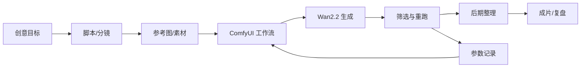
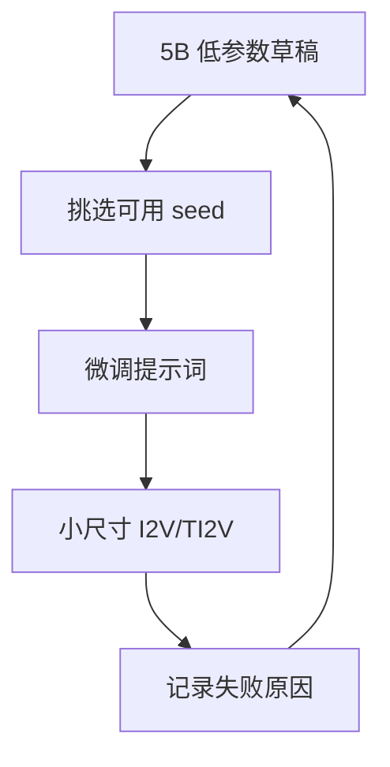
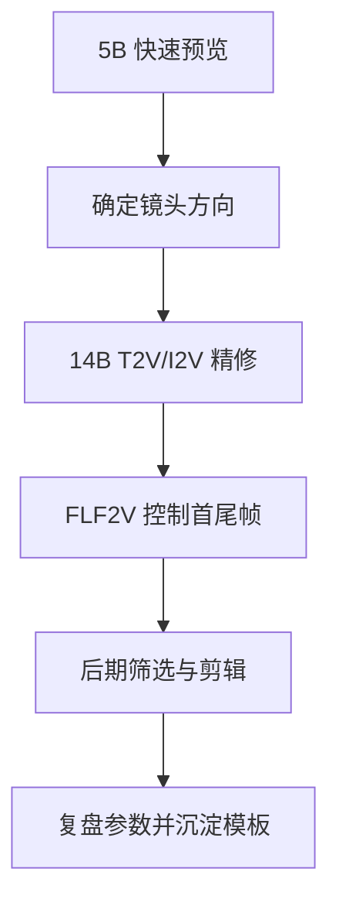

# 第 0 章：课程地图、学习成果与本地制作边界

> 建议时长：45-60 分钟
> 适用平台：macOS / Windows / Linux
> 本章定位：课程开始前的统一导览、学习路径选择和项目记录规范。

## 学习目标

完成本章后，你应该能够：

1. 说清本地 ComfyUI + Wan2.2 视频制作的完整流程。
2. 判断自己的电脑适合从哪个显存档位开始学习。
3. 建立课程项目目录、截图目录、参数记录表和作品目标。
4. 区分“跑通模型”“做出可用镜头”“完成影视作品”这三个层级。
5. 为后续每章实操留下可复现记录，而不是只保留最终视频。

## 本章产出

本章结束时，你需要得到以下 4 个交付物：

| 交付物 | 文件或位置 | 用途 |
| --- | --- | --- |
| 学习环境记录 | 本章的“学习环境记录表” | 记录系统、GPU、显存、内存、磁盘和 ComfyUI 状态。 |
| 个人学习路径 | 本章的“显存档位学习路径” | 决定后续优先使用 5B、14B T2V、14B I2V 还是 FLF2V。 |
| 课程项目目录 | `course-workspace/` 或你自己的外部素材目录 | 保存截图、工作流、提示词、输出视频和复盘记录。 |
| 截图清单 | `docs/assets/screenshots/chapter-00/` | 为后续文档补真实操作截图。 |

## 90 分钟以内教学安排

| 环节 | 建议时间 | 内容 |
| --- | ---: | --- |
| 课程目标说明 | 5 分钟 | 明确课程最终不是“点一次生成”，而是建立可复用制作流程。 |
| 制作流程原理 | 10 分钟 | 用流程图理解从创意到成片的步骤。 |
| 实例 A：产品广告路径 | 10 分钟 | 把一个产品广告拆成镜头、模型、截图和输出物。 |
| 实例 B：叙事短片路径 | 10 分钟 | 把一个故事片段拆成角色、场景、镜头和后期。 |
| 平台与显存档位 | 15 分钟 | macOS / Windows / Linux 与 8GB / 12GB / 16GB / 24GB 学习路径。 |
| 建立项目目录 | 10 分钟 | 创建课程目录、截图目录、提示词目录和工作流目录。 |
| 截图与记录规范 | 10 分钟 | 规定每章必须保存哪些截图和参数。 |
| 课后任务说明 | 5 分钟 | 完成环境记录、选择作品目标、准备下一章。 |

## 原理讲解：AI 视频制作不是单次生成

本课程把 AI 视频制作看成一条可复现的制作流水线。Wan2.2 负责生成镜头素材，ComfyUI 负责组织模型、节点、参数和输出；影视制作能力负责决定镜头是否有用。



这条流程里有三个容易混淆的层级：

| 层级 | 判断标准 | 常见误区 |
| --- | --- | --- |
| 跑通模型 | 能在本机生成一段视频。 | 以为跑通就等于学会制作。 |
| 做出可用镜头 | 视频主体稳定、运动可用、能剪进项目。 | 只看单帧好看，不检查运动和连续性。 |
| 完成影视作品 | 多个镜头能按节奏、叙事和风格组织起来。 | 只堆生成结果，没有分镜和剪辑逻辑。 |

## 平台差异：macOS / Windows / Linux

本课程后续所有安装、路径、命令和截图都会同时说明三类平台差异。第 0 章只需要完成信息记录，不需要安装或生成。

| 平台 | 你需要记录什么 | 推荐截图 | 后续重点风险 |
| --- | --- | --- | --- |
| macOS | 系统版本、芯片类型、内存、可用磁盘、是否已有 ComfyUI。 | “关于本机”或系统设置硬件信息、终端版本信息。 | Apple Silicon 与 CUDA 教程差异、部分节点兼容性、路径权限。 |
| Windows | Windows 版本、NVIDIA 驱动、GPU 型号、显存、可用磁盘、PowerShell 可用性。 | 系统信息、任务管理器 GPU 页、`nvidia-smi` 输出。 | 驱动/CUDA、路径空格、杀毒软件拦截、长路径。 |
| Linux | 发行版、内核、GPU 驱动、CUDA 状态、Python 版本、磁盘位置。 | 终端系统信息、`nvidia-smi` 输出、项目目录。 | 驱动权限、端口开放、无桌面环境、远程访问。 |

建议记录命令：

```bash
# macOS / Linux: 记录 Python 与 Git
python3 --version
git --version
```

```powershell
# Windows PowerShell: 记录 Python 与 Git
python --version
git --version
```

```bash
# NVIDIA 用户：macOS 通常没有该命令，Windows / Linux 可用
nvidia-smi
```

## 显存档位：8GB / 12GB / 16GB / 24GB

显存决定的是“从哪里起步”和“每次试错有多贵”，不是决定你能不能学习。课程第一版以官方 Wan2.2 5B、14B T2V、14B I2V、14B FLF2V 为主线。

| 显存档位 | 推荐学习路径 | 起步策略 | 不建议一开始做什么 |
| ---: | --- | --- | --- |
| 8GB | 先跑通官方 Wan2.2 5B。 | 低分辨率、短帧数、少量 seed，用 ComfyUI native offloading。 | 一开始就追 14B 高分辨率、长帧数、批量生成。 |
| 12GB | 5B 为主，谨慎尝试 14B 小尺寸。 | 用 5B 找提示词和 seed，再挑候选做 14B 小测试。 | 同时加载过多模型或做长视频矩阵实验。 |
| 16GB | 系统学习 14B T2V/I2V 小中尺寸。 | 保留草稿参数，逐步提高分辨率和帧数。 | 不记录参数就反复重跑。 |
| 24GB | 作为课程项目主力档位。 | 5B 快速预览，14B T2V/I2V/FLF2V 精修镜头。 | 直接把所有镜头都用高参数生成。 |

## 知识点 1：本地 AI 视频制作流程

本地制作流程的重点不是“安装一个软件”，而是把模型、素材、参数和结果都放进一个可复盘的项目系统。

### 实例 A：15 秒产品广告

目标：为一款虚构耳机制作 15 秒产品短片。

| 步骤 | 内容 | 推荐模型/工作流 | 记录内容 |
| --- | --- | --- | --- |
| 创意 | 耳机在暗色桌面上被灯光扫过。 | 无 | 产品卖点、视觉关键词。 |
| 分镜 | 开场、产品特写、佩戴场景、卖点镜头、收束镜头。 | 无 | 镜头号、景别、时长。 |
| 草稿 | 快速生成 2-3 个产品氛围镜头。 | Wan2.2 5B | seed、提示词、低参数。 |
| 精修 | 用产品参考图生成稳定特写。 | 14B I2V 或 FLF2V | 参考图、模型、参数、截图。 |
| 后期 | 按音乐节奏剪成 15 秒。 | 软件中立 | 素材版本、导出规格。 |

实操任务：

1. 写出一个产品名，例如“黑色无线耳机”。
2. 写出 3 个视觉关键词，例如“低调、金属、蓝色轮廓光”。
3. 填写 4 个镜头：开场、特写、动作、收束。

### 实例 B：30 秒叙事氛围短片

目标：制作一个“雨夜归家”的 30 秒短片。

| 步骤 | 内容 | 推荐模型/工作流 | 记录内容 |
| --- | --- | --- | --- |
| 创意 | 一个人在雨夜街道中看到远处灯光。 | 无 | 故事一句话。 |
| 角色 | 固定外观、服装、年龄和情绪。 | I2V / TI2V | 角色参考卡。 |
| 场景 | 雨夜街道、室内门口、窗边灯光。 | T2V / I2V | 场景提示词。 |
| 连续性 | 用首尾帧控制转场。 | FLF2V | 首帧、尾帧、镜头编号。 |
| 后期 | 慢节奏剪辑、雨声、低饱和调色。 | 软件中立 | 时间线结构、声音来源。 |

实操任务：

1. 写出一个 1 句话故事。
2. 写出主角外观的 5 个固定描述。
3. 写出 6 个镜头标题。

## 知识点 2：课程作品标准

课程中的作品不以“生成了多少视频”为标准，而以“是否能复现、是否能剪辑、是否能解释选择”为标准。

### 实例 A：产品广告验收标准

| 指标 | 合格标准 | 不合格表现 |
| --- | --- | --- |
| 产品识别 | 观众能看出主体是什么。 | 主体变形、颜色乱跳、外形不稳定。 |
| 卖点表达 | 每个镜头服务一个卖点或视觉印象。 | 镜头好看但不知道在展示什么。 |
| 视觉统一 | 光线、色彩、材质保持一致。 | 每个镜头像来自不同广告。 |
| 剪辑可用 | 镜头长度和运动方向可剪接。 | 运动突然崩坏或主体出画。 |

练习：为你的产品广告写 3 条验收标准，例如“产品轮廓不能明显变形”“不能出现乱码文字”“镜头运动必须保持慢速”。

### 实例 B：叙事短片验收标准

| 指标 | 合格标准 | 不合格表现 |
| --- | --- | --- |
| 角色一致性 | 主角发型、服装、年龄、轮廓基本稳定。 | 每个镜头像不同的人。 |
| 情绪递进 | 镜头顺序能看出情绪变化。 | 只是连续画面，没有叙事。 |
| 空间连续性 | 场景切换有方向和逻辑。 | 背景随机跳变。 |
| 声画节奏 | 音乐、环境声或剪辑节奏服务故事。 | 声音和画面无关系。 |

练习：为你的叙事短片写 3 条验收标准，例如“主角始终穿深色风衣”“雨夜环境不能突然变晴天”“结尾必须出现暖色灯光”。

## 知识点 3：硬件与时间成本

同一个创意在不同显存档位下，制作策略不一样。低显存优先减少试错成本，高显存也不能跳过草稿流程。

### 实例 A：8GB 显存学习路径



建议：

- 每次只改一个变量：seed、提示词、分辨率或帧数。
- 每组实验只保留 2-3 个候选结果。
- 先完成“看得懂流程”，再追求画质。

### 实例 B：24GB 显存项目路径



建议：

- 仍然先用低参数验证创意。
- 只把候选镜头升级到高参数。
- 每个最终镜头必须能追溯到工作流、seed、提示词和输入素材。

## 跟做实操

### 步骤 1：创建课程项目目录

如果你希望把练习素材和输出放在仓库外，可以在任意磁盘建立 `course-workspace`。如果你放在仓库内，生成视频和模型文件会被 `.gitignore` 排除。

macOS / Linux：

```bash
mkdir -p course-workspace/{screenshots,workflows,prompts,outputs,notes}
```

Windows PowerShell：

```powershell
New-Item -ItemType Directory -Force -Path course-workspace/screenshots, course-workspace/workflows, course-workspace/prompts, course-workspace/outputs, course-workspace/notes
```

### 步骤 2：填写学习环境记录表

| 项目 | 你的记录 |
| --- | --- |
| 操作系统 |  |
| CPU / 芯片 |  |
| GPU 型号 |  |
| 显存档位 | 8GB / 12GB / 16GB / 24GB / 其他 |
| 系统内存 |  |
| 可用磁盘空间 |  |
| Python 版本 |  |
| Git 版本 |  |
| 是否已安装 ComfyUI | 是 / 否 |
| 当前最想完成的作品 | 产品广告 / 叙事短片 / 音乐混剪 / 其他 |

### 步骤 3：选择第一轮学习路径

| 条件 | 建议路径 |
| --- | --- |
| 还没有安装 ComfyUI | 先完成第 2 章安装，再回到第 5 章跑通 5B。 |
| 8GB 显存 | 第 5 章先跑 5B，暂不追 14B 高质量。 |
| 12GB 显存 | 第 5 章跑 5B，第 7/10 章谨慎尝试 14B 小尺寸。 |
| 16GB 显存 | 第 5 章跑 5B，第 7/10/12 章进入 14B T2V/I2V/FLF2V。 |
| 24GB 显存 | 第 5 章跑 5B，第 6 章后系统覆盖 14B T2V/I2V/FLF2V。 |

## 截图清单

本章不强制生成视频，但必须开始建立“截图即证据”的习惯。完成实操后，把截图放到 `docs/assets/screenshots/chapter-00/`。

| 截图编号 | 建议文件名 | 截图内容 | 用途 |
| --- | --- | --- | --- |
| 00-01 | `00-01-system-info.png` | 系统版本、硬件或 GPU 信息。 | 证明学习环境。 |
| 00-02 | `00-02-project-folders.png` | 课程项目目录结构。 | 证明素材和记录目录已建立。 |
| 00-03 | `00-03-gitignore-status.png` | `.gitignore` 生效后的 Git 状态。 | 证明 `.DS_Store`、模型、输出不会进入提交。 |
| 00-04 | `00-04-learning-profile.png` | 已填写的学习环境记录表。 | 后续按显存档位选择参数。 |
| 00-05 | `00-05-comfyui-home-if-installed.png` | 如果本机已有 ComfyUI，截取首页；没有则第 2 章补。 | 作为后续实操起点。 |

## 常见错误与排查

| 错误 | 原因 | 修正方式 |
| --- | --- | --- |
| 一开始就下载所有模型 | 不知道第一版主线范围，浪费磁盘和时间。 | 先按显存档位选择 5B 或 14B 主线模型。 |
| 只保存最终视频 | 无法复现，也无法知道哪组参数有效。 | 每次保存工作流、seed、提示词、截图和输出文件名。 |
| 把模型和输出视频放进 Git | 模型和视频文件过大，不适合提交。 | 使用 `.gitignore` 排除模型权重和生成媒体。 |
| 低显存直接追高分辨率 | 显存不足、耗时过长、失败率高。 | 先用低参数草稿验证创意。 |
| 后期软件选择影响学习 | 误以为必须用某个剪辑软件。 | 本课程保持软件中立，只学习通用后期流程。 |

## 课后练习

完成以下任务后，再进入第 1 章：

1. 填写学习环境记录表。
2. 在产品广告和叙事短片中选择一个作为第一轮项目方向。
3. 写出至少 2 个作品目标：
   - 目标 A：一个 15 秒产品广告。
   - 目标 B：一个 30 秒叙事氛围短片。
4. 创建课程项目目录，并保存至少 3 张截图。
5. 写出你的显存档位和第一轮学习路径。

## 下一章衔接

零基础读者下一步先做第 0 实操入口，建立第一个项目目录并确认 ComfyUI 能打开；已经能跑通基础环境的读者，再进入第 1 章补 AI 视频生成原理。
