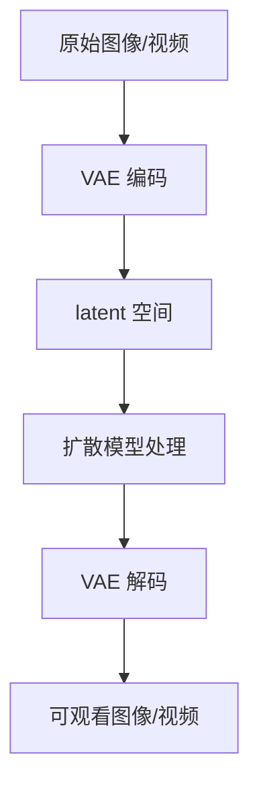

# 第 1 章：AI 视频生成基本原理

> 建议时长：75-90 分钟
> 适用平台：macOS / Windows / Linux
> 本章定位：在安装和实操前，先理解 AI 视频生成的基本机制，避免后续只会照抄节点和参数。

## 学习目标

完成本章后，你应该能够：

1. 用自己的话解释“扩散模型为什么能从噪声生成画面”。
2. 理解图像生成和视频生成的共同点与差异。
3. 说明文本编码器、VAE、采样器、latent、seed、steps 分别负责什么。
4. 理解 Wan2.2 5B、14B T2V、14B I2V、FLF2V 在输入条件上的差异。
5. 看懂 ComfyUI 视频工作流中的核心模块：模型加载、条件输入、latent 生成、采样、VAE 解码、视频输出。

## 本章产出

| 交付物 | 建议位置 | 用途 |
| --- | --- | --- |
| 原理流程图 | 本章 Mermaid 图或个人笔记 | 用来解释提示词到视频的生成链路。 |
| 核心术语表 | 本章“核心术语速查表” | 后续读节点、报错和参数时使用。 |
| 两组概念实例 | 本章实例 A / B | 对比 T2V、I2V、FLF2V 的输入差异。 |
| 截图准备清单 | `docs/assets/screenshots/chapter-01/` | 第 2-5 章实操时补截图。 |

## 90 分钟以内教学安排

| 环节 | 建议时间 | 内容 |
| --- | ---: | --- |
| 视频生成整体流程 | 10 分钟 | 先看从创意到视频的总流程。 |
| 知识点 1：扩散与去噪 | 20 分钟 | 理解从噪声到画面、从噪声序列到视频。 |
| 知识点 2：潜空间与 VAE | 20 分钟 | 理解为什么模型不是直接在原始视频像素上工作。 |
| 知识点 3：条件控制 | 20 分钟 | 对比文本、图像、首尾帧如何约束生成。 |
| Wan2.2 工作流映射 | 10 分钟 | 把原理对应到 ComfyUI 节点。 |
| 复盘与练习 | 5-10 分钟 | 完成术语表和课后问题。 |

## 原理讲解：从提示词到视频

AI 视频生成可以先理解成“连续多张图片的生成”，但不能只看成逐张图片拼接。真正有用的视频还需要时间连续性：主体不能每一帧都变样，动作不能随机跳，镜头运动要有方向。


在 ComfyUI 里，这条流程通常拆成几个节点区：

| 节点区 | 负责什么 | 你后续会看到的典型节点 |
| --- | --- | --- |
| 模型加载 | 加载 diffusion model、文本编码器、VAE。 | `Load Diffusion Model`、`Load CLIP`、`Load VAE` |
| 条件输入 | 把文字、图片、首尾帧变成模型可用的条件。 | `CLIP Text Encode`、`Load Image`、视频 latent 节点 |
| latent 准备 | 创建或编码视频 latent。 | `EmptyHunyuanLatentVideo`、`Wan22ImageToVideoLatent` |
| 采样去噪 | 按 seed、steps、cfg 等参数生成结果。 | 采样器相关节点 |
| 解码输出 | 把 latent 转成可观看的视频。 | VAE 解码、视频保存节点 |

## 零基础先记住：你真正输入了什么

初学者容易把“提示词”“图片”“模型”“参数”混成一件事。后面所有实操都按下面 5 类输入来检查：

| 输入 | 谁提供 | 在 ComfyUI 里通常出现在哪里 | 错了会怎样 |
| --- | --- | --- | --- |
| 提示词 | 你写 | `CLIP Text Encode` 或类似文本编码节点的大文本框 | 场景、动作、风格不符合预期。 |
| 参考图 | 你上传或课程提供 | `Load Image`、I2V/TI2V 图像输入节点 | 主体不稳定，或节点找不到图片。 |
| 模型文件 | 你下载到 `models/` | `UNETLoader`、`CLIPLoader`、`VAELoader` 下拉框 | 节点报红，提示缺模型或找不到文件。 |
| 采样参数 | 模板默认 + 你调整 | `KSampler` 等采样节点 | 结果不可复现、质量差、耗时过长或爆显存。 |
| 输出设置 | 模板默认 + 你记录 | `CreateVideo`、`SaveVideo` 等输出节点 | 找不到生成文件，或不知道哪个结果来自哪次实验。 |

第 5 章第一次运行时，不要同时改很多东西。只改参考图、正向提示词、宽高/帧数、seed 这几项；模型节点、负向提示词、输出节点先保持模板默认。

## 提示词怎么写：从中文创意到可输入文本

提示词不是随便写一句愿望。对视频来说，最稳的入门结构是：

```text
主体 + 动作 + 场景 + 镜头运动 + 光线/风格
```

先用中文想清楚，再写成简短英文。不是因为中文不能用，而是很多官方示例和模型训练语境中英文电影镜头词更常见，初学阶段用英文更容易和示例对照。

### 实例 A：产品短视频提示词

中文创意：

```text
一个黑色科技产品放在深色桌面上，蓝色轮廓光，镜头缓慢推进，电影感。
```

拆解：

| 部分 | 内容 | 为什么要写 |
| --- | --- | --- |
| 主体 | black futuristic product | 告诉模型画面中心是什么。 |
| 动作 | slowly rotating | 给视频运动方向。 |
| 场景 | on a dark desk | 限制背景，不让模型乱生成街道或房间。 |
| 镜头 | slow camera push-in | 给镜头运动，而不是只让主体动。 |
| 风格 | blue rim light, cinematic close-up | 控制光线和画面质感。 |

可直接输入第 5 章正向提示词节点：

```text
a black futuristic product on a dark desk, slowly rotating, blue rim light, slow camera push-in, cinematic close-up
```

### 实例 B：人物街头镜头提示词

中文创意：

```text
雨夜街道，一个人撑伞向前走，地面有反光，镜头跟拍。
```

拆解：

| 部分 | 内容 | 为什么要写 |
| --- | --- | --- |
| 主体 | a person holding an umbrella | 明确人物和道具。 |
| 动作 | walking forward | 明确动作方向。 |
| 场景 | rainy street at night | 明确时间、天气、地点。 |
| 镜头 | tracking shot | 告诉模型镜头跟随。 |
| 风格 | wet reflections, cinematic lighting | 增强画面特征。 |

可输入提示词：

```text
a person holding an umbrella walking forward on a rainy street at night, wet reflections on the road, tracking shot, cinematic lighting
```

第一次实操不要追求“长而华丽”。一个 20-40 个英文词的清晰提示词，比一大段互相冲突的描述更适合排错。

## 平台差异：macOS / Windows / Linux

本章是原理章，三平台的概念完全一致。差异主要出现在后续安装、GPU 加速和路径管理。

| 平台 | 本章需要理解的重点 | 后续实操差异 |
| --- | --- | --- |
| macOS | 概念、节点流、模型目录逻辑。 | Apple Silicon 与 CUDA 教程不同，速度和节点兼容性要单独验证。 |
| Windows | 概念、节点流、显存与 CUDA 的关系。 | 重点处理 NVIDIA 驱动、PowerShell、路径空格和模型目录。 |
| Linux | 概念、节点流、本地服务和远程访问。 | 重点处理驱动、Python 环境、端口、防火墙和权限。 |

## 显存档位：8GB / 12GB / 16GB / 24GB

本章不运行模型，但要先建立显存直觉：显存主要影响分辨率、帧数、模型大小、是否能同时保留多个模型，以及失败后的试错成本。

| 显存档位 | 原理理解重点 | 后续学习策略 |
| ---: | --- | --- |
| 8GB | 明白 offloading、低分辨率、短帧数为什么必要。 | 先用 Wan2.2 5B 跑通，14B 先作为概念理解。 |
| 12GB | 明白“能尝试”和“适合批量做项目”不是一回事。 | 5B 做草稿，14B 小尺寸谨慎验证。 |
| 16GB | 明白 high/low noise 双模型带来的质量和资源开销。 | 系统学习 14B T2V/I2V，但保留草稿流程。 |
| 24GB | 明白高显存也不能跳过筛选和记录。 | 5B 预览，14B 精修，FLF2V 做首尾控制。 |

## 知识点 1：扩散与去噪

扩散模型的核心思路可以用一句话概括：训练时学习如何给图像或视频加噪，生成时反过来一步步去噪。


在视频生成里，模型处理的不是单张图，而是一段包含时间维度的 latent。它需要同时决定“这一帧长什么样”和“下一帧怎么接上”。

### 实例 A：从噪声到静态图像

设想提示词是：

```text
a black wireless headphone on a dark desk, blue rim light, cinematic product shot
```

生成过程可以这样理解：

| 去噪阶段 | 画面变化 | 学习重点 |
| --- | --- | --- |
| 早期 | 从随机噪声中形成大概构图。 | 主体位置和大轮廓先出现。 |
| 中期 | 耳机、桌面、灯光方向逐渐明确。 | 结构和材质开始稳定。 |
| 后期 | 金属反光、边缘、阴影细节变清楚。 | 细节质量受 steps、模型和 VAE 影响。 |

实操观察方法：第 5 章跑通后，用同一个 seed 改 steps，观察低步数和高步数的差异。

### 实例 B：从噪声序列到连续视频

设想提示词是：

```text
a black wireless headphone slowly rotating on a dark desk, blue rim light, smooth camera movement
```

视频生成多了一个问题：每一帧都要像同一个耳机，旋转方向还要连续。

| 视频问题 | 好结果 | 坏结果 |
| --- | --- | --- |
| 主体一致性 | 耳机轮廓每帧基本稳定。 | 耳机忽大忽小、结构变形。 |
| 运动连续性 | 旋转方向和速度平滑。 | 前后帧跳动、突然反向。 |
| 镜头稳定性 | 背景、灯光、构图可控。 | 背景随机变化、灯光闪烁。 |

这就是为什么视频生成比图像生成更容易失败：它不只要单帧好看，还要时间上连贯。

## 知识点 2：潜空间与 VAE

模型通常不会直接在完整像素空间里生成视频。视频数据太大，直接处理成本很高。更常见的方式是把图像或视频压缩到 latent 空间里操作，再通过 VAE 解码回可观看画面。



可以把 latent 理解成“压缩后的画面信息”。它不是最终视频，但保留了模型生成所需的结构、颜色、运动和语义信息。

### 实例 A：图像编码/解码为什么影响清晰度

如果把一张产品图输入 I2V，VAE 会先把它转成 latent。这个过程如果压缩得太厉害，细节会损失。

| 输入图状态 | 可能结果 | 对策 |
| --- | --- | --- |
| 产品图清晰、主体完整 | 输出更容易保持主体。 | 优先使用干净参考图。 |
| 产品图模糊、文字很小 | 输出容易丢细节或出现乱码。 | 先换图，不要只靠提示词补救。 |

后续 I2V 章节会用产品图演示：同一个提示词下，清晰参考图和低清截图的稳定性差异。

### 实例 B：视频 VAE 为什么影响运动和压缩效率

视频 VAE 不只影响清晰度，也影响模型处理时间和显存压力。Wan2.2 5B 和 14B 工作流使用的 VAE 文件不同，后续放模型时必须按官方工作流要求匹配。

| 场景 | VAE 影响 | 常见错误 |
| --- | --- | --- |
| 5B 入门工作流 | 使用对应 5B 的 VAE，利于低显存跑通。 | VAE 放错目录或选错文件。 |
| 14B T2V/I2V | 使用 14B 工作流要求的 VAE。 | 把 5B 与 14B 的依赖混用。 |

本章只要记住：VAE 不是可有可无的附属文件，它决定 latent 和可观看画面之间如何转换。

## 知识点 3：文本条件、图像条件与首尾帧条件

条件控制决定模型“应该往哪个方向去噪”。不同 Wan2.2 工作流的核心差异，就是输入条件不同。

| 工作流 | 输入条件 | 适合场景 |
| --- | --- | --- |
| T2V | 只有文本提示词。 | 没有参考图，先探索创意和镜头方向。 |
| I2V | 一张参考图 + 可选提示词。 | 让人物、产品或场景动起来。 |
| TI2V 5B | 文本或图像都可参与。 | 低显存入门，快速跑通文字/图像到视频。 |
| FLF2V | 首帧 + 尾帧 + 提示词。 | 控制镜头从哪里开始、到哪里结束。 |

### 实例 A：纯文本控制“雨夜街道”

提示词：

```text
a quiet rainy street at night, reflections on the ground, cinematic lighting, slow dolly forward
```

T2V 的优势是自由度高。它可以从零创造场景。代价是主体、建筑、灯光和运动都由模型推断，结果不一定稳定。

| 控制项 | T2V 表现 |
| --- | --- |
| 场景 | 由提示词决定。 |
| 主体 | 没有参考图时可能变化较大。 |
| 镜头运动 | 可以描述，但需要多次 seed 筛选。 |
| 适合阶段 | 创意探索、风格测试、空镜生成。 |

### 实例 B：参考图控制“同一街道动起来”

输入：一张雨夜街道参考图。
提示词：

```text
camera slowly moves forward, rain falling, reflections shimmering on the wet road
```

I2V 的优势是画面起点明确。模型不需要从零决定街道长什么样，而是在参考图基础上生成运动。

| 控制项 | I2V 表现 |
| --- | --- |
| 场景 | 由参考图强约束。 |
| 主体 | 更容易保持原图结构。 |
| 镜头运动 | 由提示词补充。 |
| 适合阶段 | 角色保持、产品展示、已有素材动起来。 |

### 实例 C：首尾帧控制“从门外到灯光”

输入：首帧是雨夜门外，尾帧是室内暖色灯光。
提示词：

```text
the camera moves from the rainy doorway into a warm room, smooth transition, cinematic atmosphere
```

FLF2V 的优势是可以明确“开始”和“结束”。它适合做转场、情绪变化和叙事镜头。

| 控制项 | FLF2V 表现 |
| --- | --- |
| 起点 | 由首帧决定。 |
| 终点 | 由尾帧决定。 |
| 过渡 | 由提示词和模型生成。 |
| 适合阶段 | 分镜控制、镜头衔接、项目实战。 |

## 核心术语速查表

| 术语 | 简单解释 | 后续在哪些章节会用到 |
| --- | --- | --- |
| Diffusion Model | 负责从噪声中生成内容的模型。 | 第 4-13 章 |
| Noise | 生成的起点，也是模型逐步去除的随机信息。 | 第 7-9 章 |
| Sampling | 一步步去噪的过程。 | 第 9 章 |
| Steps | 去噪步数，通常影响质量和耗时。 | 第 9 章 |
| Seed | 随机种子，用来复现实验。 | 第 9、13、25 章 |
| Latent | 压缩后的图像/视频表示。 | 第 3-12 章 |
| VAE | 负责图像/视频和 latent 之间的编码、解码。 | 第 4、5、10 章 |
| Text Encoder | 把提示词转成模型能理解的条件。 | 第 5、7、8 章 |
| T2V | Text-to-Video，文字生成视频。 | 第 7-9 章 |
| I2V | Image-to-Video，图像生成视频。 | 第 10、17、19 章 |
| FLF2V | First-Last-Frame-to-Video，首尾帧生成视频。 | 第 12、18、26、27 章 |

## 跟做实操

本章不要求打开 ComfyUI。你只需要完成两个纸面练习，为后续实操建立判断力。

### 练习 1：把创意拆成生成条件

选择一个创意，把它拆成 T2V、I2V、FLF2V 三种输入。

示例：黑色耳机产品广告。

| 工作流 | 输入内容 |
| --- | --- |
| T2V | “黑色无线耳机在暗色桌面上缓慢旋转，蓝色轮廓光，电影感产品镜头。” |
| I2V | 一张清晰耳机产品图 + “slow rotation, blue rim light, cinematic product shot”。 |
| FLF2V | 首帧：耳机未亮灯；尾帧：耳机灯光亮起；提示词：灯光从暗到亮平滑过渡。 |

再写你自己的版本：

| 工作流 | 你的输入内容 |
| --- | --- |
| T2V |  |
| I2V |  |
| FLF2V |  |

### 练习 2：判断失败原因属于哪一类

把下面问题归类到“提示词问题、输入素材问题、参数问题、模型/依赖问题、后期筛选问题”。

| 现象 | 可能类别 | 你的判断 |
| --- | --- | --- |
| 人物每一帧脸都变。 | 输入素材或模型控制不足。 |  |
| 视频只生成一半就报错。 | 显存、依赖或参数问题。 |  |
| 产品上的文字变成乱码。 | 输入素材、模型能力或提示词问题。 |  |
| 画面好看但无法剪进短片。 | 后期筛选和分镜问题。 |  |

参考答案不是唯一的，但第一次可以这样判断：

| 现象 | 入门参考答案 | 下一步动作 |
| --- | --- | --- |
| 人物每一帧脸都变。 | 优先怀疑输入素材控制不足或工作流不适合保持人物一致性。 | 后续改用 I2V、角色参考图或更强控制流程。 |
| 视频只生成一半就报错。 | 优先怀疑显存、帧数、分辨率或模型依赖问题。 | 降低宽高和帧数，记录错误原文。 |
| 产品上的文字变成乱码。 | 可能是输入图文字太小、模型对文字弱、提示词要求过高。 | 换更清晰输入图，避免要求模型生成可读小字。 |
| 画面好看但无法剪进短片。 | 后期筛选和分镜问题。 | 回到镜头目的，重新定义时长、运动和衔接。 |

## 截图清单

本章是原理章，截图可以先留空。第 2-5 章实际操作时，再把对应截图补到 `docs/assets/screenshots/chapter-01/`，作为本章概念的可视证据。

| 截图编号 | 建议文件名 | 截图内容 | 用途 |
| --- | --- | --- | --- |
| 01-01 | `01-01-basic-workflow-overview.png` | 一个基础视频工作流全景。 | 对应“从提示词到视频”的流程图。 |
| 01-02 | `01-02-model-loader-nodes.png` | 模型、文本编码器、VAE 加载节点。 | 对应模型加载区。 |
| 01-03 | `01-03-text-and-image-conditions.png` | 文本条件和图像条件节点。 | 对应 T2V/I2V 输入差异。 |
| 01-04 | `01-04-latent-and-sampler.png` | latent 准备和采样节点。 | 对应扩散与去噪。 |
| 01-05 | `01-05-vae-video-output.png` | VAE 解码与视频输出节点。 | 对应 latent 到视频文件。 |

## 常见错误与排查

| 错误 | 为什么会发生 | 正确理解 |
| --- | --- | --- |
| 以为提示词越长越好 | 初学者把所有愿望堆进一句话。 | 提示词要清晰、可控，后续用分镜拆任务。 |
| 把视频生成当成逐帧图片生成 | 只关注单帧质量。 | 视频还要检查运动连续性和主体稳定性。 |
| 忽略 VAE | 只下载 diffusion model。 | VAE 是 latent 和可观看视频之间的转换器。 |
| 不记录 seed | 觉得好结果可以靠运气再生成。 | 不记录 seed 就很难复现结果。 |
| 不区分 T2V/I2V/FLF2V | 任何任务都想用同一个工作流解决。 | 先判断输入条件，再选择工作流。 |

## 课后练习

进入第 2 章前，完成以下任务：

1. 用 3 句话解释“扩散模型如何生成视频”。
2. 选一个创意，分别写出 T2V、I2V、FLF2V 的输入条件。
3. 写出你最容易混淆的 5 个术语，并用自己的话解释。
4. 根据你的显存档位，写出下一阶段的学习策略。
5. 在第 2 章安装前，确认你已经知道模型文件、文本编码器和 VAE 不是同一种东西。

## 下一章衔接

第 2 章会进入安装 ComfyUI 与启动本地服务。你会开始处理真实平台差异：macOS、Windows、Linux 的安装入口、目录结构、启动命令、浏览器访问、本地端口和常见报错。
