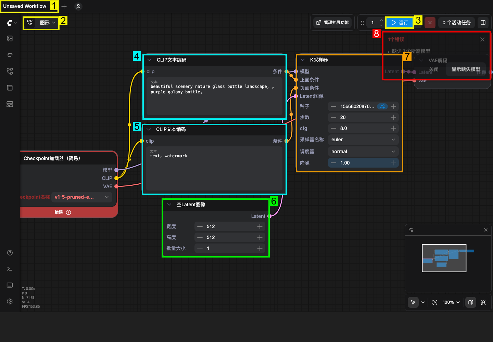
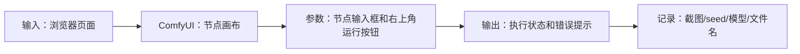

# 第 3 章：ComfyUI 界面与节点图基础

> 建议时长：75-90 分钟
> 适用平台：macOS / Windows / Linux
> 本章目标：让零基础学习者能看懂画布、节点、连线、队列和错误提示。

## 本章你会做成什么

| 产出 | 成功标准 |
| --- | --- |
| 主产出 | 一张标注过的 ComfyUI 界面截图和一份节点阅读清单 |
| 操作记录 | 至少记录 2 组实例的输入、参数、截图和结果判断。 |
| 截图 | 保存到你的项目副本 `screenshots/`；课程示例图位于 `docs/assets/screenshots/chapter-03/`。 |
| 下一章输入 | 知道哪个节点输入提示词、哪个按钮运行、哪里看错误。 |

## 实操验证边界

本章随仓库提供工作流、界面截图和记录表。生成结果、耗时、显存峰值和质量评分必须由学习者在自己的 ComfyUI 环境中记录；凡未完成实测的位置，一律标为 `待实测`，不得写成已生成。

这不是跳过实操，而是把可验证和不可验证分开：界面、模板、参数、目录、日志可以实测；真正的视频质量只能在模型文件到位后验证。

## 本章截图

### ComfyUI 首页与画布


这张图来自本机 ComfyUI。右上角能看到运行按钮，中间是节点画布，红框提示说明当前工作流缺模型，但界面已经可用。

### 系统状态接口


用于确认页面背后确实有本地服务。第 3 章读界面时，要知道前端画布和后端服务是两部分。

### 带编号的软件界面标注



这张标注图来自本章真实 ComfyUI 截图。图中的英文编号不是软件按钮原文，而是教程加上的定位标记，用来告诉初学者先看哪里。

| 编号 | 你看到的位置 | 初学者要做什么 | 不要做什么 |
| ---: | --- | --- | --- |
| 1 | 顶部工作流标签 | 确认当前正在编辑哪个工作流。 | 不要把标签名当成模型名。 |
| 2 | 左上角画布菜单/图形入口 | 用来确认当前是节点画布视图。 | 不要从这里随意清空工作流。 |
| 3 | 右上角“运行”按钮 | 参数填完、模型齐全后才点击。 | 不要在缺模型时反复点运行。 |
| 4 | 正向提示词文本框 | 输入你希望生成的内容。 | 不要把负向词写到这里。 |
| 5 | 负向提示词文本框 | 输入你不希望出现的内容，第一次可保留默认。 | 不要写故事正文。 |
| 6 | 宽高/批量一类参数 | 控制输出尺寸或任务规模。 | 低显存不要一开始拉高。 |
| 7 | 采样器参数 | 查看 seed、steps、cfg 等运行参数。 | 不要一次改多个变量。 |
| 8 | 错误提示面板 | 先读错误文字，再决定查模型、节点还是参数。 | 不要把所有红框都当安装失败。 |

## 90 分钟教学安排

| 环节 | 时间 | 做什么 |
| --- | ---: | --- |
| 成果预览 | 5 分钟 | 先看截图和本章要得到的表格/文件。 |
| 原理讲解 | 15 分钟 | 讲清 界面与节点图 的输入、处理和输出。 |
| 跟做实例 A | 20 分钟 | 完成基础实例，保证步骤可复现。 |
| 跟做实例 B | 20 分钟 | 只改变一个变量，观察差异。 |
| 截图与记录 | 10 分钟 | 保存节点、参数、目录或结果截图。 |
| 审阅复盘 | 10-20 分钟 | 用验收清单判断是否能进入下一章。 |

## 原理图



## 显存档位建议

| 显存 | 推荐做法 | 风险控制 |
| ---: | --- | --- |
| 8GB | 只做低分辨率、短帧数、单 seed；优先 5B 或只完成界面和参数演练。 | 不要同时加载 14B high/low 两个大模型；失败时先降分辨率和帧数。 |
| 12GB | 可以做 5B 完整练习，14B 只做小尺寸验证或使用 fp8/量化版本。 | 每次只跑一个候选，运行前关闭其他占显存软件。 |
| 16GB | 可以系统练习 14B T2V/I2V 的小中尺寸流程，保留草稿参数。 | 先用短帧数筛 seed，再放大，不要一开始追求 720P 长视频。 |
| 24GB | 可以完成本章 界面与节点图 的标准练习，并做 2-4 个候选对比。 | 仍然要记录 seed、模型、steps、分辨率、帧数和耗时。 |

## 本章使用的工作流或素材

- 本章不需要额外工作流 JSON。

## 跟做实操：第一次认识界面

本节只训练“看懂界面”，不要求生成成功。请按顺序操作，不要跳到模型下载或高级参数。

| 步骤 | 操作 | 你应该看到什么 | 如果不同怎么办 |
| ---: | --- | --- | --- |
| 1 | 打开浏览器，在地址栏输入 `http://127.0.0.1:8000/`。 | 页面中间出现深色网格画布，顶部有工作流标签。 | 如果网页打不开，回第 2 章检查 ComfyUI 是否启动。 |
| 2 | 看图中编号 1。 | 能看到当前工作流标签，例如 `Unsaved Workflow`。 | 标签名不同没关系，只要有画布即可。 |
| 3 | 看图中编号 4 和 5。 | 能找到两个 `CLIP文本编码` 节点，一个写正向提示词，一个写负向提示词。 | 如果工作流不同，找含有 `Prompt`、`Text Encode`、`CLIP` 的节点。 |
| 4 | 看图中编号 7。 | 能找到 `K采样器` 或采样器节点，里面有 seed、steps、cfg。 | 不要改参数，先只识别它们。 |
| 5 | 看图中编号 3。 | 能找到右上角蓝色“运行”按钮。 | 如果按钮灰掉，等待页面加载或检查工作流是否有可执行输出节点。 |
| 6 | 看图中编号 8。 | 如果有红框，先读错误文字。 | 记录错误原文，不要马上删节点。 |
| 7 | 截图保存。 | 截图能同时看到画布、提示词节点、采样器和运行按钮。 | 截图太局部就重新截全屏。 |

记录格式：

```text
页面是否打开：是/否
我找到的正向提示词节点名称：
我找到的负向提示词节点名称：
我找到的运行按钮位置：
当前错误提示原文：
截图文件名：
```

## 知识点 1：节点图的数据流

ComfyUI 的工作流不是从上到下读，而是按连线读。一个节点的输出会进入另一个节点的输入，最后到保存节点。

### 实例 A：文本到输出的最小阅读路径

| 项目 | 内容 |
| --- | --- |
| 输入 | 一个含提示词、采样、输出的工作流。 |
| 操作 | 只沿着连线从提示词节点读到输出节点。 |
| 预期现象 | 能说出“文本条件进入采样器，采样结果再解码/保存”。 |
| 判断原则 | 答案不是背节点名，而是读清楚数据流方向。 |

操作流程：

1. 放大画布，找到编号 4 的正向提示词节点。
2. 观察节点右侧输出端口，端口旁边通常写着“条件”或类似字样。
3. 顺着连线找到采样器节点。采样器负责把提示词条件、模型和 latent 合在一起生成结果。
4. 再顺着采样器输出找解码或保存节点。
5. 在记录表写一句话：`正向提示词 -> 采样器 -> 解码/保存 -> 输出文件`。


### 实例 B：图像输入到视频输出的阅读路径

| 项目 | 内容 |
| --- | --- |
| 输入 | 一个 I2V 或 TI2V 工作流。 |
| 操作 | 从 `Load Image` 或图像输入节点开始读。 |
| 预期现象 | 能说出“图像控制外观，提示词控制动作和氛围”。 |
| 判断原则 | 图像输入不是输出结果，它是生成条件。 |

操作流程：

1. 找到图像输入节点。
2. 确认它连接到视频 latent 或条件节点。
3. 找到提示词节点并比较两条输入。
4. 写下图像和文字各自负责什么。


## 知识点 2：端口、参数和数据类型

端口决定节点能不能连接；参数决定节点怎么工作。新手最常见问题是把不同类型的线乱接。

### 实例 A：识别提示词输入框

| 项目 | 内容 |
| --- | --- |
| 输入 | 正向提示词和负向提示词节点。 |
| 操作 | 只修改文本框，不改模型和采样参数。 |
| 预期现象 | 工作流结构不变，只改变生成意图。 |
| 判断原则 | 文本框属于参数，不是连线端口。 |

操作流程：

1. 点击编号 4 的正向提示词节点，不要点节点旁边的小圆点端口。
2. 找到节点里的大文本框；这里才是你输入文字的位置。
3. 先输入一条短提示词，例如：

   ```text
   a black product on a dark desk, blue rim light, slow camera push-in
   ```

4. 不改其他节点，截图记录“我只改了正向提示词”。
5. 如果想撤销，按 `Cmd+Z`（macOS）或 `Ctrl+Z`（Windows/Linux）。


### 实例 B：识别 IMAGE、LATENT、MODEL 类型

| 项目 | 内容 |
| --- | --- |
| 输入 | 一个包含图像、latent、模型加载节点的工作流。 |
| 操作 | 看端口旁边的类型文字和连线颜色。 |
| 预期现象 | 能解释为什么 IMAGE 不能随便接到 MODEL。 |
| 判断原则 | 类型不匹配时，连线无法正确执行。 |

操作流程：

1. 放大节点端口。
2. 读端口旁边的类型名。
3. 记录 3 种类型的用途。
4. 不要靠颜色猜，要看文字。


## 知识点 3：队列、运行和错误提示

点击运行后任务进入队列。页面红框并不一定代表 ComfyUI 安装失败，很多时候只是模型缺失或参数不完整。

### 实例 A：服务成功但模型缺失

| 项目 | 内容 |
| --- | --- |
| 输入 | 当前本机页面中的缺模型工作流。 |
| 操作 | 观察红色错误框，不下载模型也能判断错误类型。 |
| 预期现象 | 页面可打开，但生成不能继续。 |
| 判断原则 | 这是模型准备问题，不是 ComfyUI 安装问题。 |

操作流程：

1. 打开首页。
2. 看到红框后先读文字。
3. 记录缺少的是模型还是节点。
4. 回到第 4 章处理模型目录。


### 实例 B：页面打不开

| 项目 | 内容 |
| --- | --- |
| 输入 | 浏览器地址 `http://127.0.0.1:8000/`。 |
| 操作 | 访问首页和 `/system_stats`。 |
| 预期现象 | 两个都打不开。 |
| 判断原则 | 这是服务未启动或端口问题，和模型无关。 |

操作流程：

1. 刷新首页。
2. 访问 `/system_stats`。
3. 如果都失败，打开日志。
4. 寻找 `Python server is ready`。


## 实操记录表

| 编号 | 本章任务 | 你实际找到的位置 | 截图文件 | 判断 |
| --- | --- | --- | --- | --- |
| A | 找到正向提示词节点，并写出它连接到哪个节点。 | 例如：`CLIP文本编码` 右侧条件端口连接到 `K采样器`。 | 例如：`03-prompt-path.png` | 能说出提示词不是直接输出视频，而是先变成条件。 |
| B | 找到运行按钮和错误提示，判断当前是服务问题还是工作流问题。 | 例如：右上角“运行”按钮可见，红框写“缺少所需模型”。 | 例如：`03-error-panel.png` | 能说明页面已打开，但模型文件未准备好。 |

## 截图清单

| 截图编号 | 文件 | 内容 | 状态 |
| --- | --- | --- | --- |
| 03-01 | `03-01-comfyui-interface-overview.png` | ComfyUI 首页与画布 | 已纳入本章 |
| 03-02 | `03-02-comfyui-system-stats.png` | 系统状态接口 | 已纳入本章 |
| 03-03 | `03-03-interface-callouts.png` | ComfyUI 界面编号标注 | 已纳入本章 |

## 常见错误与排查

| 错误 | 常见原因 | 处理 |
| --- | --- | --- |
| 连线看不懂 | 按节点摆放位置读，而不是按连线读。 | 从最终输出节点反向追溯输入。 |
| 运行按钮点了没反应 | 工作流没有可执行路径或前端还在加载。 | 等页面加载完，再看控制台和错误提示。 |
| 把红框都当安装失败 | 没有区分服务错误和工作流错误。 | 先确认首页和 system_stats 是否能打开。 |

## 本章验收清单

- [ ] 能用自己的话解释 界面与节点图 在课程里的作用。
- [ ] 完成实例 A 和实例 B 的输入、操作、输出、答案记录。
- [ ] 至少保存 2 张本章截图。
- [ ] 知道 8GB / 12GB / 16GB / 24GB 应该怎么降级或放大参数。
- [ ] 如果本机缺模型，能说明缺哪个文件、应放到哪个目录。
- [ ] 能写出下一章继续学习需要带走的参数、素材或问题。

## 课后练习

1. 截一张自己的 ComfyUI 首页图，并圈出画布、节点、运行按钮、错误提示。
2. 找出一个提示词节点和一个输出节点，写出它们之间的数据流。
3. 写下“模型缺失”和“服务打不开”的区别。


## 参考资料

- [ComfyUI Wan2.2 官方工作流教程](https://docs.comfy.org/tutorials/video/wan/wan2_2)
- [ComfyUI Wan2.2 示例](https://comfyanonymous.github.io/ComfyUI_examples/wan22/)
- [Wan2.2 官方仓库](https://github.com/Wan-Video/Wan2.2)
- [ComfyUI 系统需求](https://docs.comfy.org/installation/system_requirements/)

## 下一章衔接

第 4 章会处理模型文件、显存和存储位置。
