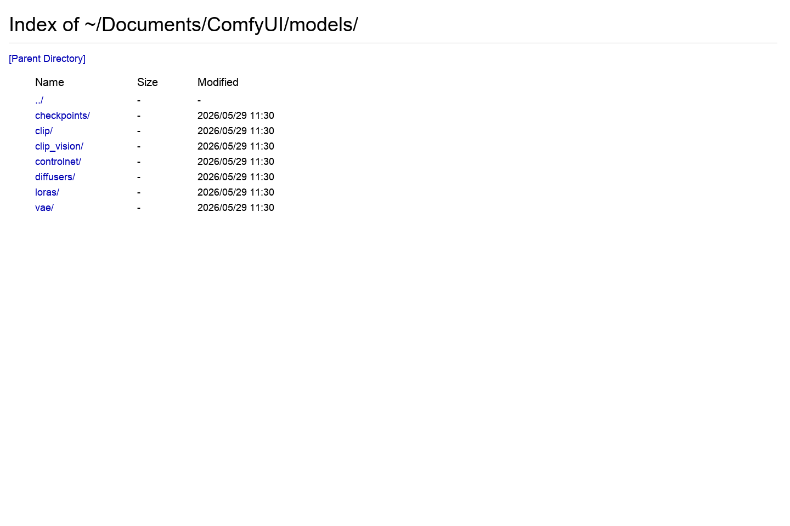
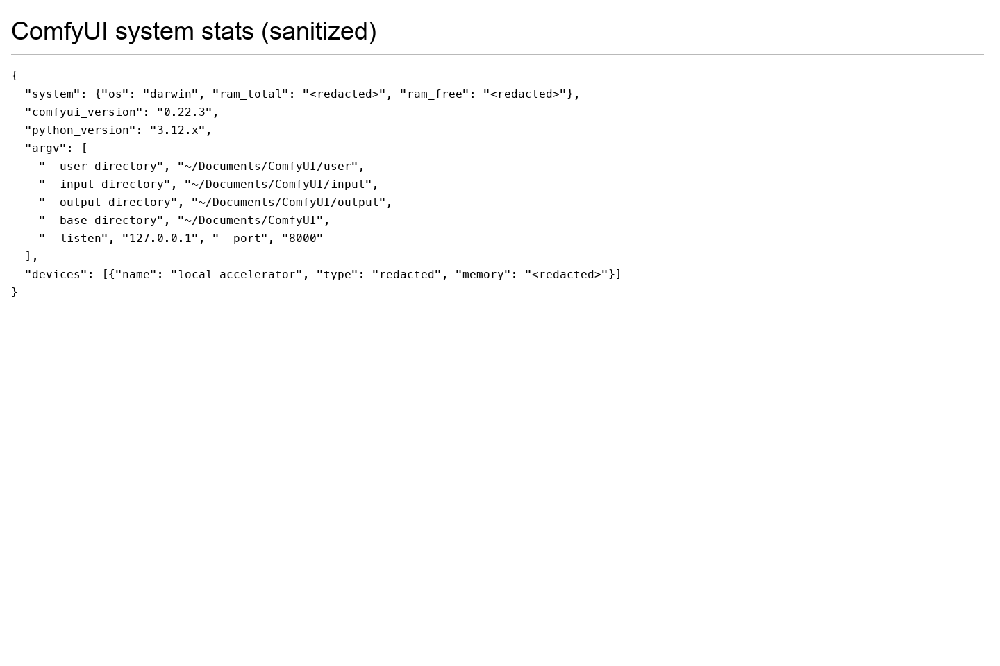

# 第 4 章：模型文件、显存与存储管理

> 建议时长：75-90 分钟
> 适用平台：macOS / Windows / Linux
> 本章目标：让学习者知道 Wan2.2 文件放哪里、为什么会占显存、怎么按显存档位选择参数。

## 本章你会做成什么

| 产出 | 成功标准 |
| --- | --- |
| 主产出 | 一份本机模型目录清单和 Wan2.2 文件放置表 |
| 操作记录 | 至少记录 2 组实例的输入、参数、截图和结果判断。 |
| 截图 | 保存到你的项目副本 `screenshots/`；课程示例图位于 `docs/assets/screenshots/chapter-04/`。 |
| 下一章输入 | 知道 5B、14B T2V、14B I2V、FLF2V 需要哪些文件。 |

## 实操验证边界

本章随仓库提供工作流、界面截图和记录表。生成结果、耗时、显存峰值和质量评分必须由学习者在自己的 ComfyUI 环境中记录；凡未完成实测的位置，一律标为 `待实测`，不得写成已生成。

这不是跳过实操，而是把可验证和不可验证分开：界面、模板、参数、目录、日志可以实测；真正的视频质量只能在模型文件到位后验证。

## 本章截图

### ComfyUI models 目录



本机模型目录截图。Wan2.2 主模型通常放 `diffusion_models/`，文本编码器放 `text_encoders/`，VAE 放 `vae/`。

### system_stats 设备信息



通过系统状态页查看当前设备和内存信息。课程示例截图显示 Apple Silicon 的 `mps`；Windows NVIDIA 环境通常会显示 CUDA 相关设备。

## 90 分钟教学安排

| 环节 | 时间 | 做什么 |
| --- | ---: | --- |
| 成果预览 | 5 分钟 | 先看截图和本章要得到的表格/文件。 |
| 原理讲解 | 15 分钟 | 讲清 模型与显存管理 的输入、处理和输出。 |
| 跟做实例 A | 20 分钟 | 完成基础实例，保证步骤可复现。 |
| 跟做实例 B | 20 分钟 | 只改变一个变量，观察差异。 |
| 截图与记录 | 10 分钟 | 保存节点、参数、目录或结果截图。 |
| 审阅复盘 | 10-20 分钟 | 用验收清单判断是否能进入下一章。 |

## 原理图


## 显存档位建议

| 显存 | 推荐做法 | 风险控制 |
| ---: | --- | --- |
| 8GB | 只做低分辨率、短帧数、单 seed；优先 5B 或只完成界面和参数演练。 | 不要同时加载 14B high/low 两个大模型；失败时先降分辨率和帧数。 |
| 12GB | 可以做 5B 完整练习，14B 只做小尺寸验证或使用 fp8/量化版本。 | 每次只跑一个候选，运行前关闭其他占显存软件。 |
| 16GB | 可以系统练习 14B T2V/I2V 的小中尺寸流程，保留草稿参数。 | 先用短帧数筛 seed，再放大，不要一开始追求 720P 长视频。 |
| 24GB | 可以完成本章 模型与显存管理 的标准练习，并做 2-4 个候选对比。 | 仍然要记录 seed、模型、steps、分辨率、帧数和耗时。 |

## 本章使用的工作流或素材

- [Wan2.2 5B TI2V 工作流](../assets/workflows/wan22/video_wan2_2_5B_ti2v.json)
- [Wan2.2 14B T2V 工作流](../assets/workflows/wan22/video_wan2_2_14B_t2v.json)
- [Wan2.2 14B I2V 工作流](../assets/workflows/wan22/video_wan2_2_14B_i2v.json)
- [Wan2.2 14B FLF2V 工作流](../assets/workflows/wan22/video_wan2_2_14B_flf2v.json)

## 模型文件到底从哪里来

模型文件名不是凭空写的。本课程优先从工作流 JSON 和官方模板中的 `Model Links` 读取文件名，再按 ComfyUI 目录规则放置。

以第 5 章的 5B TI2V JSON 为例，里面明确写了这些文件：

| JSON 节点 | 需要的文件名 | 应放目录 | 在软件里怎么验证 |
| --- | --- | --- | --- |
| `UNETLoader` | `wan2.2_ti2v_5B_fp16.safetensors` | `models/diffusion_models/` | 模型加载节点下拉框能选到这个文件。 |
| `CLIPLoader` | `umt5_xxl_fp8_e4m3fn_scaled.safetensors` | `models/text_encoders/` | 文本编码器节点下拉框能选到这个文件。 |
| `VAELoader` | `wan2.2_vae.safetensors` | `models/vae/` | VAE 节点下拉框能选到这个文件。 |

如果你还没有下载模型，工作流也能拖进 ComfyUI，但运行前会报缺模型。这不是教程失败，而是告诉你下一步要补哪个文件。

## 跟做实操：先做模型目录体检

本节不要求你立刻下载所有模型，先把目录和文件名搞清楚。

| 步骤 | 操作 | 你应该看到什么 | 记录什么 |
| ---: | --- | --- | --- |
| 1 | 打开 ComfyUI 基础目录。macOS 本机示例是 `<你的 ComfyUI 基础目录>`。 | 里面有 `input/`、`output/`、`models/` 等目录。 | 写下你自己的基础目录。 |
| 2 | 打开 `models/`。 | 能看到若干模型子目录。 | 截图保存为模型目录图。 |
| 3 | 找 `diffusion_models/`。 | 这里放 Wan2.2 主模型。 | 如果没有就创建同名目录。 |
| 4 | 找 `text_encoders/`。 | 这里放 UMT5 等文本编码器。 | 如果没有就创建同名目录。 |
| 5 | 找 `vae/`。 | 这里放 VAE 文件。 | 如果没有就创建同名目录。 |
| 6 | 对照工作流文件名。 | 每个节点要求的文件名都能在对应目录里找到。 | 缺哪个就写进“缺模型清单”。 |

缺模型清单模板：

```text
工作流：video_wan2_2_5B_ti2v.json
缺少 diffusion model：
缺少 text encoder：
缺少 VAE：
我已经放入的目录：
下一步要下载的文件：
```

## 知识点 1：模型文件类型

Wan2.2 不是一个文件就能运行。常见组合包括 diffusion model、text encoder、VAE，有些工作流还需要 LoRA。

### 实例 A：5B TI2V 文件放置

| 项目 | 内容 |
| --- | --- |
| 输入 | `wan2.2_ti2v_5B_fp16.safetensors`、`umt5_xxl_fp8_e4m3fn_scaled.safetensors`、`wan2.2_vae.safetensors`。 |
| 操作 | 分别放入 diffusion_models、text_encoders、vae。 |
| 预期现象 | 工作流下拉框能看到对应文件。 |
| 判断原则 | 5B 是入门优先模型，目录放错会导致节点找不到文件。 |

操作流程：

1. 打开第 2 章确认过的 ComfyUI 基础目录。
2. 进入 `models/diffusion_models/`，把 `wan2.2_ti2v_5B_fp16.safetensors` 放进去。
3. 进入 `models/text_encoders/`，把 `umt5_xxl_fp8_e4m3fn_scaled.safetensors` 放进去。
4. 进入 `models/vae/`，把 `wan2.2_vae.safetensors` 放进去。
5. 保持文件名完全一致，不要改成 `wan模型.safetensors` 或 `5B.safetensors`。
6. 回到 ComfyUI，刷新页面或重启服务，再打开工作流看下拉框是否能选到这些文件。


### 实例 B：14B T2V high/low 双模型放置

| 项目 | 内容 |
| --- | --- |
| 输入 | `wan2.2_t2v_high_noise_14B_fp8_scaled.safetensors` 和 `wan2.2_t2v_low_noise_14B_fp8_scaled.safetensors`。 |
| 操作 | 两个文件都放入 `models/diffusion_models/`。 |
| 预期现象 | T2V 工作流能分别选择 high noise 和 low noise。 |
| 判断原则 | 14B T2V 不是二选一，官方流程需要高噪声和低噪声阶段配合。 |

操作流程：

1. 确认两个文件都下载完整。
2. 不要把其中一个放进 `checkpoints/`。
3. 刷新模型列表。
4. 在工作流里确认两个下拉框都能选中。

如果下拉框看不到文件，按这个顺序排查：

1. 文件是否还在浏览器下载目录，没有移动到 `models/diffusion_models/`。
2. 文件名是否被系统自动改成 `xxx (1).safetensors`。
3. 目录是否拼写错误，例如写成了 `diffusion_model/` 少了 `s`。
4. ComfyUI 是否需要重启或刷新模型列表。

### 实例 C：14B I2V / FLF2V 与 LoRA 依赖核对

仓库内置 I2V 和 FLF2V JSON 使用的是 `fp8_scaled` 版本，不是 `fp16` 版本。不要凭文件名猜测，要以工作流 JSON 里的 `Model Links` 和节点下拉框为准。

| 类型 | 文件名 | 目录 | 什么时候必须准备 |
| --- | --- | --- | --- |
| I2V / FLF2V high noise | `wan2.2_i2v_high_noise_14B_fp8_scaled.safetensors` | `models/diffusion_models/` | 使用 14B I2V 或 FLF2V 主流程时。 |
| I2V / FLF2V low noise | `wan2.2_i2v_low_noise_14B_fp8_scaled.safetensors` | `models/diffusion_models/` | 使用 14B I2V 或 FLF2V 主流程时。 |
| 通用文本编码器 | `umt5_xxl_fp8_e4m3fn_scaled.safetensors` | `models/text_encoders/` | 5B 和 14B 工作流都会用到。 |
| 14B VAE | `wan_2.1_vae.safetensors` | `models/vae/` | 14B T2V / I2V / FLF2V 工作流。 |
| I2V / FLF2V 4-step LoRA | `wan2.2_i2v_lightx2v_4steps_lora_v1_high_noise.safetensors`、`wan2.2_i2v_lightx2v_4steps_lora_v1_low_noise.safetensors` | `models/loras/` | 只在启用 4-step 加速分组时需要。 |

LoRA 的作用是加速或改变生成特性，不是基础模型本体。初学者先用非 LoRA 主流程跑通；等能稳定生成后，再启用 4-step 分组比较速度、质量和运动损失。


## 知识点 2：显存压力来源

显存压力主要来自模型大小、分辨率、帧数、steps、批量数量和是否同时加载多个模型。

### 实例 A：低分辨率短帧数预览

| 项目 | 内容 |
| --- | --- |
| 输入 | 640x640、49-81 帧、单 seed。 |
| 操作 | 先跑小任务确认流程。 |
| 预期现象 | 速度较快，适合判断提示词方向。 |
| 判断原则 | 草稿不是最终质量，它的任务是快速排错和筛选。 |

操作流程：

1. 设置较低宽高。
2. 减少帧数。
3. 固定 seed。
4. 记录耗时和是否爆显存。


### 实例 B：提高分辨率导致显存上涨

| 项目 | 内容 |
| --- | --- |
| 输入 | 从 640x640 提到接近 720P。 |
| 操作 | 只提高分辨率，其他参数不变。 |
| 预期现象 | 耗时和显存明显上涨，低显存可能失败。 |
| 判断原则 | 分辨率不是免费提升，必须逐步放大。 |

操作流程：

1. 复制同一工作流。
2. 只改宽高。
3. 运行前记录旧参数。
4. 失败时回退到上一档。


## 知识点 3：命名与版本管理

模型和输出都要能追溯来源。新手把文件改成中文名或随意移动，会让工作流难以复现。

### 实例 A：保留官方模型文件名

| 项目 | 内容 |
| --- | --- |
| 输入 | 官方下载的 `.safetensors` 文件。 |
| 操作 | 不改名，按目录存放。 |
| 预期现象 | 节点下拉框显示原文件名。 |
| 判断原则 | 保留官方文件名最利于排错和和教程对照。 |

操作流程：

1. 下载后检查文件大小。
2. 保留英文原名。
3. 放入对应目录。
4. 在记录表写来源链接。


### 实例 B：输出视频按镜头编号命名

| 项目 | 内容 |
| --- | --- |
| 输入 | `S01_SH03_v01_seed1234.mp4`。 |
| 操作 | 保存输出时包含项目、镜头、版本、seed。 |
| 预期现象 | 后期筛选时能知道每个文件来自哪个实验。 |
| 判断原则 | 输出命名是项目管理，不是可有可无。 |

操作流程：

1. 确定项目编号。
2. 确定镜头编号。
3. 记录 seed。
4. 把文件名写进实操记录表。


## 实操记录表

| 编号 | 工作流 | 需要的模型文件 | 应放目录 | 我的检查结果 |
| --- | --- | --- | --- | --- |
| A | 5B TI2V | `wan2.2_ti2v_5B_fp16.safetensors` | `models/diffusion_models/` | 已有/缺失/文件名不一致 |
| A | 5B TI2V | `umt5_xxl_fp8_e4m3fn_scaled.safetensors` | `models/text_encoders/` | 已有/缺失/文件名不一致 |
| A | 5B TI2V | `wan2.2_vae.safetensors` | `models/vae/` | 已有/缺失/文件名不一致 |
| B | 14B T2V | `wan2.2_t2v_high_noise_14B_fp8_scaled.safetensors` | `models/diffusion_models/` | 已有/缺失/文件名不一致 |
| B | 14B T2V | `wan2.2_t2v_low_noise_14B_fp8_scaled.safetensors` | `models/diffusion_models/` | 已有/缺失/文件名不一致 |
| C | 14B I2V / FLF2V | `wan2.2_i2v_high_noise_14B_fp8_scaled.safetensors` | `models/diffusion_models/` | 已有/缺失/文件名不一致 |
| C | 14B I2V / FLF2V | `wan2.2_i2v_low_noise_14B_fp8_scaled.safetensors` | `models/diffusion_models/` | 已有/缺失/文件名不一致 |
| C | 14B T2V / I2V / FLF2V | `wan_2.1_vae.safetensors` | `models/vae/` | 已有/缺失/文件名不一致 |
| C | 14B T2V 4-step LoRA | `wan2.2_t2v_lightx2v_4steps_lora_v1.1_high_noise.safetensors` | `models/loras/` | 未启用/已启用/缺失 |
| C | 14B T2V 4-step LoRA | `wan2.2_t2v_lightx2v_4steps_lora_v1.1_low_noise.safetensors` | `models/loras/` | 未启用/已启用/缺失 |
| C | 14B I2V/FLF2V 4-step LoRA | `wan2.2_i2v_lightx2v_4steps_lora_v1_high_noise.safetensors` | `models/loras/` | 未启用/已启用/缺失 |
| C | 14B I2V/FLF2V 4-step LoRA | `wan2.2_i2v_lightx2v_4steps_lora_v1_low_noise.safetensors` | `models/loras/` | 未启用/已启用/缺失 |

## 截图清单

| 截图编号 | 文件 | 内容 | 状态 |
| --- | --- | --- | --- |
| 04-01 | `04-01-comfyui-models-folder.png` | ComfyUI models 目录 | 已纳入本章 |
| 04-02 | `04-02-comfyui-system-stats.png` | system_stats 设备信息 | 已纳入本章 |

## 常见错误与排查

| 错误 | 常见原因 | 处理 |
| --- | --- | --- |
| 模型放进 checkpoints 但节点看不到 | Wan2.2 工作流读取的是 diffusion_models 等目录。 | 按模型类型重新放置。 |
| 下载文件名后面多了 `(1)` | 重复下载或浏览器自动改名。 | 保留唯一官方文件名，删除重复文件。 |
| 低显存机器直接跑 14B 失败 | 任务规模超过显存。 | 先用 5B 或小参数验证。 |

## 本章验收清单

- [ ] 能用自己的话解释 模型与显存管理 在课程里的作用。
- [ ] 完成实例 A 和实例 B 的输入、操作、输出、答案记录。
- [ ] 至少保存 2 张本章截图。
- [ ] 知道 8GB / 12GB / 16GB / 24GB 应该怎么降级或放大参数。
- [ ] 如果本机缺模型，能说明缺哪个文件、应放到哪个目录。
- [ ] 能写出下一章继续学习需要带走的参数、素材或问题。

## 课后练习

1. 列出你的 `models/` 下已有目录。
2. 按 5B、14B T2V、14B I2V、FLF2V 做一张模型文件清单。
3. 写出你显存档位对应的草稿参数。


## 参考资料

- [ComfyUI Wan2.2 官方工作流教程](https://docs.comfy.org/tutorials/video/wan/wan2_2)
- [ComfyUI Wan2.2 示例](https://comfyanonymous.github.io/ComfyUI_examples/wan22/)
- [Wan2.2 官方仓库](https://github.com/Wan-Video/Wan2.2)
- [ComfyUI 系统需求](https://docs.comfy.org/installation/system_requirements/)

## 下一章衔接

第 5 章会用第 4 章的目录和参数原则，完成第一次可运行短视频测试。
