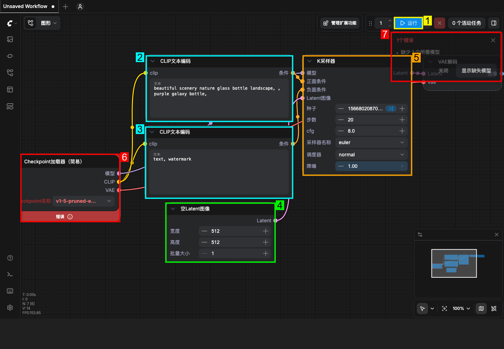
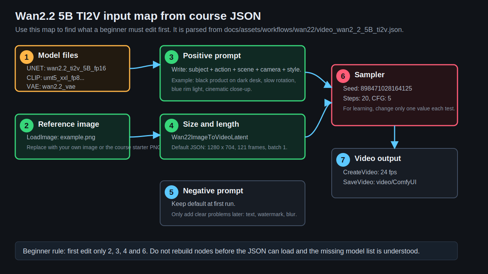
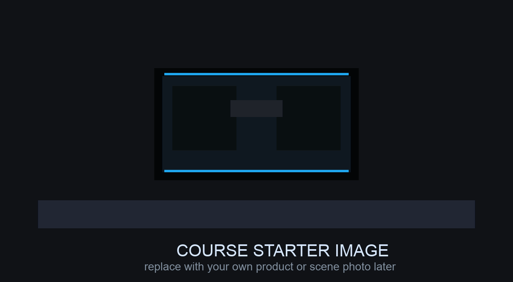

# 第 5 章：第一次生成：从静态图到短视频测试

> 建议时长：75-90 分钟
> 适用平台：macOS / Windows / Linux
> 本章目标：让学习者用 TI2V-5B 路径完成第一次从输入到输出的完整记录；课程方真实输出样例待补。

## 本章你会做成什么

| 产出 | 成功标准 |
| --- | --- |
| 主产出 | 首次跑通清单、参数记录表和待实测位置；模型到位后补一段短视频测试记录。 |
| 操作记录 | 至少记录 2 组实例的输入、参数、截图和结果判断。 |
| 截图 | 保存到你的项目副本 `screenshots/`；课程示例图位于 `docs/assets/screenshots/chapter-05/`。 |
| 下一章输入 | 带着可运行的工作流记录进入 Wan2.2 模型家族学习 |

## 实操验证边界

本章随仓库提供工作流、界面截图和记录表。生成结果、耗时、显存峰值和质量评分必须由学习者在自己的 ComfyUI 环境中记录；凡未完成实测的位置，一律标为 `待实测`，不得写成已生成。

这不是跳过实操，而是把可验证和不可验证分开：界面、模板、参数、目录、日志可以实测；真正的视频质量只能在模型文件到位后验证。

## 本章截图

### Wan2.2 5B TI2V 模板预览


来自本机 ComfyUI 模板包。它是模板预览图，用来说明模板可能生成的视频类型，不是节点截图，也不代表你本机已经生成成功。真正要找输入节点，请看后面的编号标注图和输入地图。

### 本机模型缺失状态


当前本机没有模型，所以会出现模型缺失提示。本章把它作为真实排错步骤处理。

### 第一次运行的输入位置标注



这张图用本机 ComfyUI 截图标出了第一次运行要关注的位置。截图里的节点是本机当前可见工作流，用来教你认位置；实际 Wan2.2 5B 模板的节点名称会不同，但“提示词、尺寸、采样、模型、运行按钮、错误提示”的判断方式相同。

| 编号 | 位置 | 第一次要做什么 |
| ---: | --- | --- |
| 1 | 运行按钮 | 所有输入检查完再点。模型缺失时只点一次用于确认错误，不要反复运行。 |
| 2 | 正向提示词 | 输入你希望画面出现的主体、动作、场景、镜头和风格。 |
| 3 | 负向提示词 | 第一次保留模板默认，后面再加 `text, watermark, blur` 等排除词。 |
| 4 | 宽高/批量或视频尺寸节点 | 低显存先降尺寸和帧数。 |
| 5 | 采样器 | 检查 seed、steps、cfg，第一次固定 seed。 |
| 6 | 模型下拉框 | 如果红框，先记录缺哪个模型文件。 |
| 7 | 错误提示 | 先读原文，再回第 4 章放模型。 |

### Wan2.2 5B TI2V 输入地图



这张图不是软件截图，而是根据本章 JSON 解析出来的输入地图。它解决的问题是：拖入 JSON 后，新手应该先找哪些节点、先改哪些值。

### 课程自带入门参考图



这张图由课程生成，用来练习 `LoadImage` 加载图片和 I2V/TI2V 输入链路。它不是成片素材，正式项目可以换成自己的产品图、人物图或场景图。

## 90 分钟教学安排

| 环节 | 时间 | 做什么 |
| --- | ---: | --- |
| 成果预览 | 5 分钟 | 先看截图和本章要得到的表格/文件。 |
| 原理讲解 | 15 分钟 | 讲清 第一次短视频测试 的输入、处理和输出。 |
| 跟做实例 A | 20 分钟 | 完成基础实例，保证步骤可复现。 |
| 跟做实例 B | 20 分钟 | 只改变一个变量，观察差异。 |
| 截图与记录 | 10 分钟 | 保存节点、参数、目录或结果截图。 |
| 审阅复盘 | 10-20 分钟 | 用验收清单判断是否能进入下一章。 |

## 原理图


## 显存档位建议

| 显存 | 推荐做法 | 风险控制 |
| ---: | --- | --- |
| 8GB | 只做低分辨率、短帧数、单 seed；优先 5B 或只完成界面和参数演练。 | 不要同时加载 14B high/low 两个大模型；失败时先降分辨率和帧数。 |
| 12GB | 可以做 5B 完整练习，14B 只做小尺寸验证或使用 fp8/量化版本。 | 每次只跑一个候选，运行前关闭其他占显存软件。 |
| 16GB | 可以系统练习 14B T2V/I2V 的小中尺寸流程，保留草稿参数。 | 先用短帧数筛 seed，再放大，不要一开始追求 720P 长视频。 |
| 24GB | 可以完成本章 第一次短视频测试 的标准练习，并做 2-4 个候选对比。 | 仍然要记录 seed、模型、steps、分辨率、帧数和耗时。 |

## 本章使用的工作流或素材

- [Wan2.2 5B TI2V 工作流](../assets/workflows/wan22/video_wan2_2_5B_ti2v.json)
- [课程自带入门参考图](../assets/inputs/chapter-05/05-input-starter-product.png)
- [出版验证证据包骨架](../../evidence/chapter-05-first-run/README.md)

## 跟做实操：从空白到第一次点击运行

这一节是本章最重要的部分。请把它当成“照着操作的清单”，不要先改风格、插件或高级节点。

### 第 0 步：准备你要拖入的软件和文件

| 需要准备 | 文件或位置 | 作用 |
| --- | --- | --- |
| ComfyUI 页面 | `http://127.0.0.1:8000/` | 操作界面。 |
| 工作流 JSON | `docs/assets/workflows/wan22/video_wan2_2_5B_ti2v.json` | 告诉 ComfyUI 要加载哪些节点。 |
| 练习图片 | `docs/assets/inputs/chapter-05/05-input-starter-product.png` | 作为第一次 I2V/TI2V 的参考图。 |
| 模型文件 | 第 4 章列出的 5B diffusion、UMT5、VAE | 让工作流真正能运行。没有模型也可以先练习导入和排错。 |

### 第 1 步：导入工作流

1. 打开 ComfyUI 首页。
2. 把 `video_wan2_2_5B_ti2v.json` 从文件管理器拖到 ComfyUI 画布中间。
3. 等待 1-3 秒，画布上应出现一组 Wan2.2 相关节点。
4. 如果软件弹出确认或导入提示，选择加载/导入工作流。
5. 截图保存，文件名建议：`05-workflow-loaded.png`。

如果你不想拖 JSON，也可以打开当前界面的“浏览模板”，搜索 `Wan2.2`，选择 5B TI2V 或名称相近的视频模板。不同版本入口位置可能不同，所以本课程优先使用拖入 JSON。

### 第 2 步：让图片进入 ComfyUI

1. 打开 ComfyUI 的 `input/` 目录。macOS 本机示例是 `<你的 ComfyUI 基础目录>/input`。
2. 把课程图片 `05-input-starter-product.png` 复制进去。
3. 回到 ComfyUI，找到 `LoadImage` 节点。
4. 在图片下拉框里选择 `05-input-starter-product.png`。如果看不到，刷新页面或重新打开图片下拉框。
5. 记录：`参考图 = 05-input-starter-product.png`。

图片也可以来自你自己的相册、相机、设计稿或其他图像生成工具。第一次练习先用课程图，是为了排除“图片路径错误”这个变量。

### 第 3 步：写第一条正向提示词

先不要自由发挥，按第 1 章公式写：

```text
主体 + 动作 + 场景 + 镜头运动 + 光线/风格
```

本章第一次直接输入：

```text
a black futuristic product on a dark desk, slowly rotating, blue rim light, slow camera push-in, cinematic close-up
```

把它填到 `CLIP Text Encode (Positive Prompt)` 或含有 `Positive Prompt` 的文本节点中。不要填到负向提示词节点。

负向提示词第一次保持模板默认。如果模板为空，可以先填：

```text
text, watermark, logo, blurry, low quality, distorted shape, extra objects, flickering
```

### 第 4 步：设置最小参数

本章 JSON 默认是 `1280 x 704`、`121` 帧、`20` steps。对低显存新手来说，这可能太大。第一次优先按显存降级：

| 显存 | 宽 x 高 | 帧数 | steps | seed | 为什么 |
| ---: | --- | ---: | ---: | --- | --- |
| 8GB | 512 x 288 或 640 x 360 | 33-49 | 12-16 | 固定 | 先验证链路，避免一上来爆显存。 |
| 12GB | 640 x 360 或 640 x 480 | 49-65 | 16-20 | 固定 | 适合第一次完整试跑。 |
| 16GB | 832 x 480 或 960 x 544 | 65-81 | 20 | 固定 | 可以观察更完整运动。 |
| 24GB | 1280 x 704 | 81-121 | 20-30 | 固定 | 可以接近模板默认，但仍先跑短版本。 |

本章 JSON 的 `KSampler` 默认 seed 数值后面跟着 `randomize`。第一次实测时，先把 seed 随机化模式改成固定；不同 ComfyUI 界面可能显示为 `fixed`、`control_after_generate=fixed` 或“禁用随机化”。记录 seed 原值和随机化模式，方便失败后复查。

### 第 5 步：点击运行并记录结果

1. 确认模型节点没有红框。如果有红框，先读缺失文件名。
2. 确认图片节点已经选中 `05-input-starter-product.png`。
3. 确认正向提示词已经替换为本章给出的提示词。
4. 确认宽高、帧数、steps、seed 都记录在表格里。
5. 点击右上角“运行”。
6. 如果生成成功，打开 `output/` 目录记录最新视频文件名。
7. 如果失败，记录错误原文、截图和缺失文件名；这也是有效实操结果。

## 知识点 1：导入工作流

工作流是可复用的节点配置。第一次生成不要自己从零搭节点，先用官方模板。

拖入本章 JSON 后，先找这些节点，不要在画布上乱改连线：

| 你要找的东西 | 5B JSON 中的节点 | 你要输入或检查什么 |
| --- | --- | --- |
| 主模型 | `UNETLoader` | 文件名应是 `wan2.2_ti2v_5B_fp16.safetensors`。 |
| 文本编码器 | `CLIPLoader` | 文件名应是 `umt5_xxl_fp8_e4m3fn_scaled.safetensors`，类型为 `wan`。 |
| VAE | `VAELoader` | 文件名应是 `wan2.2_vae.safetensors`。 |
| 参考图 | `LoadImage` | 第一次选择 `05-input-starter-product.png`。 |
| 正向提示词 | `CLIP Text Encode (Positive Prompt)` | 填本章给出的产品短视频提示词。 |
| 负向提示词 | `CLIP Text Encode (Negative Prompt)` | 第一次保留默认或填基础排除词。 |
| 视频尺寸与长度 | `Wan22ImageToVideoLatent` | 按显存表设置宽、高、帧数、batch。 |
| 采样 | `KSampler` | 检查 seed、随机化模式、steps、cfg，不要一次改多个变量。 |
| 预期现象 | `CreateVideo`、`SaveVideo` | 检查 fps 和输出前缀，生成后去 `output/` 找文件。 |

### 实例 A：从软件内“浏览模板”加载 5B TI2V

| 项目 | 内容 |
| --- | --- |
| 输入 | ComfyUI 首页和当前界面的“浏览模板”入口。 |
| 操作 | 打开“浏览模板”，搜索 `Wan2.2`，选择 5B TI2V 或名称相近的视频模板。 |
| 预期现象 | 画布出现完整节点图。 |
| 判断原则 | 模板加载成功后才进入参数设置。 |

操作流程：

1. 打开 ComfyUI 首页，确认画布顶部出现工作流标签。
2. 在当前界面中找到“浏览模板”入口；如果入口位置不同，用界面搜索或命令面板查找“浏览模板”。
3. 在模板窗口搜索 `Wan2.2`，选择 `5B TI2V` 或名称相近的视频模板。
4. 加载模板后，确认画布出现提示词、模型加载、采样、视频保存等节点。
5. 如果模板窗口显示预览图，只把它当作“模板用途预览”，不要把预览图当作你本机已经生成的结果。


### 实例 B：拖入 JSON 加载工作流

| 项目 | 内容 |
| --- | --- |
| 输入 | `docs/assets/workflows/wan22/video_wan2_2_5B_ti2v.json`。 |
| 操作 | 把 JSON 文件拖到 ComfyUI 画布。 |
| 预期现象 | 出现相同或相近节点。 |
| 判断原则 | JSON 是工作流配置，不是模型文件。 |

操作流程：

1. 在文件管理器中打开 `docs/assets/workflows/wan22/`。
2. 找到 `video_wan2_2_5B_ti2v.json`。
3. 鼠标按住这个 JSON 文件，拖到 ComfyUI 画布中间再松开。
4. 等待节点加载；如果画布没有变化，再确认你拖的是 `.json`，不是截图或模型文件。
5. 加载后保存一份个人副本，命名为 `my_first_wan22_5b_ti2v.json`。


## 知识点 2：最小可运行参数

第一次生成只验证链路。低分辨率、短帧数、少 seed 可以更快暴露模型路径和节点问题。

参数不是随便改。第一次只用下面这张表：

| 参数 | 在哪里改 | 第一次推荐值 | 你要记录什么 |
| --- | --- | --- | --- |
| 图片 | `LoadImage` | `05-input-starter-product.png` | 图片文件名。 |
| 正向提示词 | Positive Prompt 文本框 | 本章产品提示词 | 完整提示词。 |
| 宽高 | `Wan22ImageToVideoLatent` | 按显存表 | 宽、高。 |
| 帧数 | `Wan22ImageToVideoLatent` | 33-121 | 帧数。 |
| seed | `KSampler` | 固定数字 | seed 原值。 |
| steps | `KSampler` | 12-20 | steps 数值。 |
| cfg | `KSampler` | 4-6 | cfg 数值。 |
| fps | `CreateVideo` | 24 | 输出帧率。 |

### 实例 A：低分辨率短帧数草稿

| 项目 | 内容 |
| --- | --- |
| 输入 | 640x640、49-81 帧、固定 seed。 |
| 操作 | 只跑一个 seed。 |
| 预期现象 | 在模型齐全、显存足够、工作流无红节点时，预期得到短视频；未完成实测时只记录缺模型或待实测状态。 |
| 判断原则 | 模型缺失也算有效排错输出，不能假装生成成功。 |

操作流程：

1. 在 `LoadImage` 里选择课程参考图。
2. 在正向提示词节点输入本章给出的产品提示词。
3. 在 `Wan22ImageToVideoLatent` 里按显存表设置宽、高、帧数。
4. 在 `KSampler` 里把 seed 设为固定，不使用随机。
5. 点击运行并记录结果：成功、缺模型、爆显存或其他错误。


### 实例 B：同提示词提高尺寸对比

| 项目 | 内容 |
| --- | --- |
| 输入 | 同一提示词，尺寸从 640x640 提高。 |
| 操作 | 只改尺寸，其他不动。 |
| 预期现象 | 耗时/显存增加，画面可能更清晰。 |
| 判断原则 | 这是尺寸变量实验，不是提示词实验。 |

操作流程：

1. 复制 A 的记录。
2. 只修改宽高。
3. 运行或记录预期风险。
4. 对比耗时和输出。

本例的正确记录方式：

| 对比项 | A | B |
| --- | --- | --- |
| 提示词 | 完全相同 | 完全相同 |
| 参考图 | 完全相同 | 完全相同 |
| seed | 完全相同 | 完全相同 |
| 改动 | 低分辨率 | 只提高宽高 |
| 结论 | 用来判断链路是否跑通 | 用来观察分辨率对显存和耗时的影响 |


## 知识点 3：输出文件管理

生成成功只是一半。教程项目必须保存输出、参数、截图和工作流，否则无法复盘。

### 实例 A：按日期保存测试视频

| 项目 | 内容 |
| --- | --- |
| 输入 | `2026-05-29_first_test_seed1234.mp4`。 |
| 操作 | 输出后改名或记录生成文件名。 |
| 预期现象 | 文件可追溯到日期和 seed。 |
| 判断原则 | 文件名要服务复现，不要只叫 final.mp4。 |

操作流程：

1. 打开 output 目录。
2. 找到最新视频。
3. 记录文件名。
4. 写入实操记录表。


### 实例 B：按镜头编号保存输出

| 项目 | 内容 |
| --- | --- |
| 输入 | `S01_SH01_v01_seed1234.mp4`。 |
| 操作 | 把第一次测试当成镜头 1 记录。 |
| 预期现象 | 后续项目可直接引用。 |
| 判断原则 | 项目化命名从第一章实操就开始。 |

操作流程：

1. 确定项目编号。
2. 确定镜头编号。
3. 记录版本号。
4. 同步保存工作流 JSON。


## 实操记录表

| 编号 | 输入素材/提示词 | 模型 | seed | steps | 分辨率/帧数 | 输出文件 | 判断 |
| --- | --- | --- | ---: | ---: | --- | --- | --- |
| A | `05-input-starter-product.png` + 本章产品提示词 | 5B TI2V | 固定 | 12-20 | 按显存表 | 成功：写视频文件名；失败：写错误原文 | 成功/缺模型/爆显存/其他 |
| B | 与 A 完全相同 | 5B TI2V | 与 A 相同 | 与 A 相同 | 只改宽高 | 成功：写视频文件名；失败：写错误原文 | 写清宽高变化带来的影响 |

完整记录示例：

| 项目 | 示例填写 |
| --- | --- |
| 工作流 | `video_wan2_2_5B_ti2v.json` |
| 参考图 | `05-input-starter-product.png` |
| 正向提示词 | `a black futuristic product on a dark desk, slowly rotating, blue rim light, slow camera push-in, cinematic close-up` |
| 负向提示词 | 模板默认，或 `text, watermark, logo, blurry, low quality, distorted shape, extra objects, flickering` |
| 分辨率/帧数 | 8GB 示例：`512 x 288`，`33` 帧 |
| seed | 固定 seed，填写节点中的数字 |
| steps/cfg | `12-20` / `4-6` |
| 运行结果 | 成功则写输出文件；失败则写错误原文和截图文件。 |

## 截图清单

| 截图编号 | 文件 | 内容 | 状态 |
| --- | --- | --- | --- |
| 05-01 | `05-01-wan22-5b-ti2v-template.webp` | Wan2.2 5B TI2V 模板预览 | 已纳入本章 |
| 05-02 | `05-02-comfyui-home-model-missing.png` | 本机模型缺失状态 | 已纳入本章 |
| 05-03 | `05-03-first-run-input-callouts.png` | 第一次运行输入位置标注 | 已纳入本章 |
| 05-04 | `05-04-wan22-5b-input-map.svg` | 根据 5B JSON 解析的输入地图 | 已纳入本章 |
| 05-input | `05-input-starter-product.png` | 课程自带入门参考图 | 已纳入本章 |

## 常见错误与排查

| 错误 | 常见原因 | 处理 |
| --- | --- | --- |
| 节点红框提示缺模型 | 模型文件没有放到工作流要求的目录。 | 先看本章模型清单，把文件放入 `models/diffusion_models/`、`models/text_encoders/`、`models/vae/` 或 `models/loras/`。 |
| 显存不足或运行中断 | 分辨率、帧数、steps 或模型规模超过本机显存。 | 按显存表降到短帧数、低分辨率、单 seed，再逐步放大。 |
| 结果无法复现 | 没有记录 seed、模型、提示词、工作流版本。 | 每次运行后立刻填写实操记录表。 |

## 本章验收清单

- [ ] 能用自己的话解释 第一次短视频测试 在课程里的作用。
- [ ] 完成实例 A 和实例 B 的输入、操作、输出、答案记录。
- [ ] 至少保存 2 张本章截图。
- [ ] 知道 8GB / 12GB / 16GB / 24GB 应该怎么降级或放大参数。
- [ ] 如果本机缺模型，能说明缺哪个文件、应放到哪个目录。
- [ ] 能写出下一章继续学习需要带走的参数、素材或问题。

## 课后练习

1. 导入 5B TI2V 工作流并截图。
2. 把课程入门参考图复制到 ComfyUI 的 `input/` 目录，并在 `LoadImage` 节点中选中它。
3. 写一组 30 字以内提示词，并按“主体、动作、场景、镜头、风格”拆解。
4. 如果本机缺模型，写出缺少文件名和应放目录。
5. 如果模型齐全，生成一段低分辨率短视频并记录 seed、steps、cfg、宽高、帧数和输出文件名。


## 参考资料

- [ComfyUI Wan2.2 官方工作流教程](https://docs.comfy.org/tutorials/video/wan/wan2_2)
- [ComfyUI Wan2.2 示例](https://comfyanonymous.github.io/ComfyUI_examples/wan22/)
- [Wan2.2 官方仓库](https://github.com/Wan-Video/Wan2.2)
- [ComfyUI 系统需求](https://docs.comfy.org/installation/system_requirements/)

## 下一章衔接

第 6 章会系统比较 5B、14B T2V、14B I2V 和 FLF2V 的使用场景。
