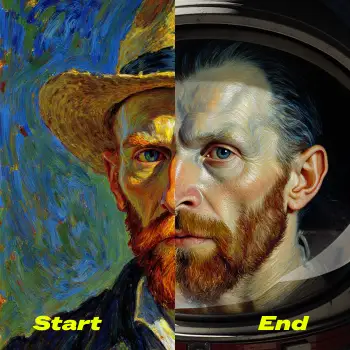

# 第 12 章：FLF2V 首尾帧视频：控制开始与结束

> 建议时长：75-90 分钟
> 适用平台：macOS / Windows / Linux
> 本章目标：让学习者用首帧和尾帧控制视频过渡，而不是只靠文字猜结果。

## 本章你会做成什么

| 产出 | 成功标准 |
| --- | --- |
| 主产出 | 2 段首尾帧过渡练习记录 |
| 操作记录 | 至少记录 2 组实例的输入、参数、截图和结果判断。 |
| 截图 | 保存到你的项目副本 `screenshots/`；课程示例图位于 `docs/assets/screenshots/chapter-12/`。 |
| 下一章输入 | 理解连续性问题并进入质量评估 |

## 实操验证边界

本章随仓库提供工作流、界面截图和记录表。生成结果、耗时、显存峰值和质量评分必须由学习者在自己的 ComfyUI 环境中记录；凡未完成实测的位置，一律标为 `待实测`，不得写成已生成。

这不是跳过实操，而是把可验证和不可验证分开：界面、模板、参数、目录、日志可以实测；真正的视频质量只能在模型文件到位后验证。

## 本章截图

### Wan2.2 14B FLF2V 模板

FLF2V 通过两个图像输入控制开始和结束。

### FLF2V 输入素材预览

模板预览里包含首帧/尾帧输入位置，适合学习节点定位。

## 90 分钟教学安排

| 环节 | 时间 | 做什么 |
| --- | ---: | --- |
| 成果预览 | 5 分钟 | 先看截图和本章要得到的表格/文件。 |
| 原理讲解 | 15 分钟 | 讲清 FLF2V 的输入、处理和输出。 |
| 跟做实例 A | 20 分钟 | 完成基础实例，保证步骤可复现。 |
| 跟做实例 B | 20 分钟 | 只改变一个变量，观察差异。 |
| 截图与记录 | 10 分钟 | 保存节点、参数、目录或结果截图。 |
| 审阅复盘 | 10-20 分钟 | 用验收清单判断是否能进入下一章。 |

## 原理图

## 显存档位建议

| 显存 | 推荐做法 | 风险控制 |
| ---: | --- | --- |
| 8GB | 只做低分辨率、短帧数、单 seed；优先 5B 或只完成界面和参数演练。 | 不要同时加载 14B high/low 两个大模型；失败时先降分辨率和帧数。 |
| 12GB | 可以做 5B 完整练习，14B 只做小尺寸验证或使用 fp8/量化版本。 | 每次只跑一个候选，运行前关闭其他占显存软件。 |
| 16GB | 可以系统练习 14B T2V/I2V 的小中尺寸流程，保留草稿参数。 | 先用短帧数筛 seed，再放大，不要一开始追求 720P 长视频。 |
| 24GB | 可以完成本章 FLF2V 的标准练习，并做 2-4 个候选对比。 | 仍然要记录 seed、模型、steps、分辨率、帧数和耗时。 |

## 本章使用的工作流或素材

- [14B FLF2V 工作流](../assets/workflows/wan22/video_wan2_2_14B_flf2v.json)

## 跟做实操

1. 打开 ComfyUI 首页。
2. 优先把本章提供的 JSON 拖到 ComfyUI 画布；如果要用软件内模板入口，请打开当前界面的“浏览模板”，搜索 `Wan2.2` 并选择对应视频模板。
3. 按截图定位提示词、模型、尺寸、帧数、seed 和输出节点。
4. 如果节点提示缺模型，先记录缺失文件名，不要乱改节点。
5. 按显存档位选择草稿参数。
6. 运行后把输出文件名、seed、参数、截图写入记录表。

## 知识点 1：首尾帧设计

首尾帧不是随便两张图。主体、构图和尺寸越一致，过渡越稳定。

### 实例 A：产品从关闭到点亮

| 项目 | 内容 |
| --- | --- |
| 输入 | 同一产品两张图：屏幕关闭、屏幕点亮。 |
| 操作 | 分别放入起始和结束 Load Image。 |
| 预期现象 | 在条件满足时预期生成点亮过渡。 |
| 判断原则 | 这是 FLF2V 的典型稳定任务。 |

操作流程：

1. 准备同构图两张图。
2. 第一张放 start。
3. 第二张放 end。
4. 提示词写 light turns on。

### 实例 B：角色从正脸到侧脸

| 项目 | 内容 |
| --- | --- |
| 输入 | 同一角色正脸和侧脸。 |
| 操作 | 保持服装和背景一致。 |
| 预期现象 | 在条件满足时预期生成转头过渡。 |
| 判断原则 | 人物过渡比产品更难，要降低动作复杂度。 |

操作流程：

1. 准备同角色两帧。
2. 检查尺寸比例。
3. 填写 gentle head turn。
4. 观察身份保持。

## 知识点 2：过渡描述

提示词要描述从首帧到尾帧的运动，不要描述无关新内容。

### 实例 A：平滑推镜过渡

| 项目 | 内容 |
| --- | --- |
| 输入 | `smooth transition, slow dolly in, consistent lighting`。 |
| 操作 | 让镜头运动平稳。 |
| 预期现象 | 画面有推进感。 |
| 判断原则 | 适合广告和氛围镜头。 |

操作流程：

1. 保留首尾帧。
2. 加入 smooth transition。
3. 设置短帧数。
4. 记录过渡稳定性。

### 实例 B：快速运动转场

| 项目 | 内容 |
| --- | --- |
| 输入 | `fast motion transition, dynamic camera movement`。 |
| 操作 | 提高运动强度。 |
| 预期现象 | 更刺激但更容易变形。 |
| 判断原则 | 快速转场要用更严格的首尾帧。 |

操作流程：

1. 复制 A。
2. 只改过渡词。
3. 保持 seed。
4. 比较变形程度。

## 知识点 3：连续性问题

连续性看主体、背景、光线和运动方向。只有首尾帧相似，不代表中间一定自然。

### 实例 A：主体形变排查

| 项目 | 内容 |
| --- | --- |
| 输入 | 产品首尾帧形状差异大。 |
| 操作 | 运行后检查中间帧。 |
| 预期现象 | 可能出现融化或结构错误。 |
| 判断原则 | 先修首尾帧一致性。 |

操作流程：

1. 截取中间帧。
2. 对比产品轮廓。
3. 标注变形位置。
4. 重做尾帧。

### 实例 B：背景跳变排查

| 项目 | 内容 |
| --- | --- |
| 输入 | 首帧室内、尾帧室外。 |
| 操作 | 过渡跨度过大。 |
| 预期现象 | 中间背景可能跳变。 |
| 判断原则 | 拆成两个镜头比硬过渡更稳。 |

操作流程：

1. 比较两帧背景。
2. 判断跨度。
3. 必要时加中间帧。
4. 拆分镜头。

## 实操记录表

| 编号 | 输入素材/提示词 | 模型 | seed | steps | 分辨率/帧数 | 输出文件 | 判断 |
| --- | --- | --- | ---: | ---: | --- | --- | --- |
| A | 按实例 A 填写 | 按本章推荐 | 固定 | 按显存档位 | 草稿参数 | 运行后填写 | 成功/失败/待重跑 |
| B | 按实例 B 填写 | 与 A 相同或只改一个变量 | 固定或记录新 seed | 不乱改 | 与 A 对比 | 运行后填写 | 写清变化原因 |

## 截图清单

| 截图编号 | 文件 | 内容 | 状态 |
| --- | --- | --- | --- |
| 12-01 | `12-01-wan22-14b-flf2v-template.webp` | Wan2.2 14B FLF2V 模板 | 已纳入本章 |
| 12-02 | `12-02-wan22-flf2v-inputs.webp` | FLF2V 输入素材预览 | 已纳入本章 |

## 常见错误与排查

| 错误 | 常见原因 | 处理 |
| --- | --- | --- |
| 节点红框提示缺模型 | 模型文件没有放到工作流要求的目录。 | 先看本章模型清单，把文件放入 `models/diffusion_models/`、`models/text_encoders/`、`models/vae/` 或 `models/loras/`。 |
| 显存不足或运行中断 | 分辨率、帧数、steps 或模型规模超过本机显存。 | 按显存表降到短帧数、低分辨率、单 seed，再逐步放大。 |
| 结果无法复现 | 没有记录 seed、模型、提示词、工作流版本。 | 每次运行后立刻填写实操记录表。 |

## 本章验收清单

- [ ] 能用自己的话解释 FLF2V 在课程里的作用。
- [ ] 完成实例 A 和实例 B 的输入、操作、输出、答案记录。
- [ ] 至少保存 2 张本章截图。
- [ ] 知道 8GB / 12GB / 16GB / 24GB 应该怎么降级或放大参数。
- [ ] 如果本机缺模型，能说明缺哪个文件、应放到哪个目录。
- [ ] 能写出下一章继续学习需要带走的参数、素材或问题。

## 课后练习

1. 准备一组产品首尾帧。
2. 准备一组人物首尾帧。
3. 分别写平滑过渡和快速过渡提示词。

## 参考资料

- [ComfyUI Wan2.2 官方工作流教程](https://docs.comfy.org/tutorials/video/wan/wan2_2)
- [ComfyUI Wan2.2 示例](https://comfyanonymous.github.io/ComfyUI_examples/wan22/)
- [Wan2.2 官方仓库](https://github.com/Wan-Video/Wan2.2)
- [ComfyUI 系统需求](https://docs.comfy.org/installation/system_requirements/)

## 下一章衔接

第 13 章会系统评价生成结果是否可用。
