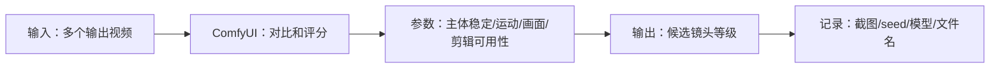

# 第 13 章：质量评估与批量对比

> 建议时长：75-90 分钟
> 适用平台：macOS / Windows / Linux
> 本章目标：让学习者建立视频生成结果的评分标准，避免只凭感觉选片。

## 本章你会做成什么

| 产出 | 成功标准 |
| --- | --- |
| 主产出 | 一张视频质量评分表 |
| 操作记录 | 至少记录 2 组实例的输入、参数、截图和结果判断。 |
| 截图 | 保存到你的项目副本 `screenshots/`；课程示例图位于 `docs/assets/screenshots/chapter-13/`。 |
| 下一章输入 | 把评分表用于后续镜头语言章节 |

## 实操验证边界

本章随仓库提供工作流、界面截图和记录表。生成结果、耗时、显存峰值和质量评分必须由学习者在自己的 ComfyUI 环境中记录；凡未完成实测的位置，一律标为 `待实测`，不得写成已生成。

这不是跳过实操，而是把可验证和不可验证分开：界面、模板、参数、目录、日志可以实测；真正的视频质量只能在模型文件到位后验证。

## 本章截图

### T2V 候选来源

T2V 可以批量生成多个 seed，再按评分表筛选。

### I2V 候选来源

I2V 更适合评估主体保持和参考图一致性。

## 90 分钟教学安排

| 环节 | 时间 | 做什么 |
| --- | ---: | --- |
| 成果预览 | 5 分钟 | 先看截图和本章要得到的表格/文件。 |
| 原理讲解 | 15 分钟 | 讲清 质量评估 的输入、处理和输出。 |
| 跟做实例 A | 20 分钟 | 完成基础实例，保证步骤可复现。 |
| 跟做实例 B | 20 分钟 | 只改变一个变量，观察差异。 |
| 截图与记录 | 10 分钟 | 保存节点、参数、目录或结果截图。 |
| 审阅复盘 | 10-20 分钟 | 用验收清单判断是否能进入下一章。 |

## 原理图

## 显存档位建议

| 显存 | 推荐做法 | 风险控制 |
| ---: | --- | --- |
| 8GB | 只做低分辨率、短帧数、单 seed；优先 5B 或只完成界面和参数演练。 | 不要同时加载 14B high/low 两个大模型；失败时先降分辨率和帧数。 |
| 12GB | 可以做 5B 完整练习，14B 只做小尺寸验证或使用 fp8/量化版本。 | 每次只跑一个候选，运行前关闭其他占显存软件。 |
| 16GB | 可以系统练习 14B T2V/I2V 的小中尺寸流程，保留草稿参数。 | 先用短帧数筛 seed，再放大，不要一开始追求 720P 长视频。 |
| 24GB | 可以完成本章 质量评估 的标准练习，并做 2-4 个候选对比。 | 仍然要记录 seed、模型、steps、分辨率、帧数和耗时。 |

## 本章使用的工作流或素材

- [14B T2V 工作流](../assets/workflows/wan22/video_wan2_2_14B_t2v.json)
- [14B I2V 工作流](../assets/workflows/wan22/video_wan2_2_14B_i2v.json)

## 跟做实操

1. 打开 ComfyUI 首页。
2. 优先把本章提供的 JSON 拖到 ComfyUI 画布；如果要用软件内模板入口，请打开当前界面的“浏览模板”，搜索 `Wan2.2` 并选择对应视频模板。
3. 按截图定位提示词、模型、尺寸、帧数、seed 和输出节点。
4. 如果节点提示缺模型，先记录缺失文件名，不要乱改节点。
5. 按显存档位选择草稿参数。
6. 运行后把输出文件名、seed、参数、截图写入记录表。

## 知识点 1：画面质量评估

画面质量不是只看清晰。还要看脸、手、产品轮廓、文字和背景是否稳定。

### 实例 A：人物面部稳定性评分

| 项目 | 内容 |
| --- | --- |
| 输入 | 同一提示词 3 个 seed 的人物视频。 |
| 操作 | 暂停首帧、中间帧、尾帧检查脸。 |
| 预期现象 | 给每条视频 1-5 分。 |
| 判断原则 | 脸部漂移严重的镜头不能进精修。 |

操作流程：

1. 打开输出视频。
2. 截三帧。
3. 检查脸和手。
4. 填写分数。

### 实例 B：产品轮廓评分

| 项目 | 内容 |
| --- | --- |
| 输入 | 产品 I2V 输出。 |
| 操作 | 检查边缘、logo、材质。 |
| 预期现象 | 可用/待修/淘汰。 |
| 判断原则 | 产品识别度比背景华丽更重要。 |

操作流程：

1. 截关键帧。
2. 圈出轮廓问题。
3. 检查标志。
4. 写入评分表。

## 知识点 2：运动质量评估

视频能不能用，关键在运动是否自然和连续。

### 实例 A：慢动作是否自然

| 项目 | 内容 |
| --- | --- |
| 输入 | slow dolly in 或 slow rotation 输出。 |
| 操作 | 逐帧看是否跳动。 |
| 预期现象 | 稳定运动得分更高。 |
| 判断原则 | 慢动作适合初学者筛选。 |

操作流程：

1. 播放 0.5 倍速。
2. 看主体是否抖动。
3. 看背景是否飘。
4. 评分。

### 实例 B：快速动作是否破碎

| 项目 | 内容 |
| --- | --- |
| 输入 | fast camera movement 输出。 |
| 操作 | 检查拖影、断裂、变形。 |
| 预期现象 | 快速动作常需要淘汰或重做。 |
| 判断原则 | 快不等于好剪，稳定更重要。 |

操作流程：

1. 定位运动最快片段。
2. 截取失败帧。
3. 标注问题。
4. 决定是否重跑。

## 知识点 3：可用性评估

可用性是能不能进入剪辑。一个镜头可以不完美，但必须服务片子。

### 实例 A：可直接剪入短片

| 项目 | 内容 |
| --- | --- |
| 输入 | 主体稳定、运动自然、时长合适的视频。 |
| 操作 | 标记为 A 级候选。 |
| 预期现象 | 进入成片素材池。 |
| 判断原则 | A 级镜头才值得后期放大和调色。 |

操作流程：

1. 看完整视频。
2. 确认无致命错误。
3. 写入 A 级。
4. 移动到候选目录。

### 实例 B：只作为灵感草稿

| 项目 | 内容 |
| --- | --- |
| 输入 | 构图好但人物手部错误。 |
| 操作 | 标记为 B/C 级。 |
| 预期现象 | 保留提示词，不进成片。 |
| 判断原则 | 草稿价值是提供方向，不是强行使用。 |

操作流程：

1. 写出可取之处。
2. 写出失败点。
3. 决定是否重跑。
4. 保存提示词。

## 实操记录表

| 编号 | 输入素材/提示词 | 模型 | seed | steps | 分辨率/帧数 | 输出文件 | 判断 |
| --- | --- | --- | ---: | ---: | --- | --- | --- |
| A | 按实例 A 填写 | 按本章推荐 | 固定 | 按显存档位 | 草稿参数 | 运行后填写 | 成功/失败/待重跑 |
| B | 按实例 B 填写 | 与 A 相同或只改一个变量 | 固定或记录新 seed | 不乱改 | 与 A 对比 | 运行后填写 | 写清变化原因 |

## 截图清单

| 截图编号 | 文件 | 内容 | 状态 |
| --- | --- | --- | --- |
| 13-01 | `13-01-wan22-14b-t2v-template.webp` | T2V 候选来源 | 已纳入本章 |
| 13-02 | `13-02-wan22-14b-i2v-template.webp` | I2V 候选来源 | 已纳入本章 |

## 常见错误与排查

| 错误 | 常见原因 | 处理 |
| --- | --- | --- |
| 节点红框提示缺模型 | 模型文件没有放到工作流要求的目录。 | 先看本章模型清单，把文件放入 `models/diffusion_models/`、`models/text_encoders/`、`models/vae/` 或 `models/loras/`。 |
| 显存不足或运行中断 | 分辨率、帧数、steps 或模型规模超过本机显存。 | 按显存表降到短帧数、低分辨率、单 seed，再逐步放大。 |
| 结果无法复现 | 没有记录 seed、模型、提示词、工作流版本。 | 每次运行后立刻填写实操记录表。 |

## 本章验收清单

- [ ] 能用自己的话解释 质量评估 在课程里的作用。
- [ ] 完成实例 A 和实例 B 的输入、操作、输出、答案记录。
- [ ] 至少保存 2 张本章截图。
- [ ] 知道 8GB / 12GB / 16GB / 24GB 应该怎么降级或放大参数。
- [ ] 如果本机缺模型，能说明缺哪个文件、应放到哪个目录。
- [ ] 能写出下一章继续学习需要带走的参数、素材或问题。

## 课后练习

1. 为 3 个输出建立评分表。
2. 每个输出截首中尾三帧。
3. 选出 1 个 A 级候选和 1 个淘汰案例。

## 参考资料

- [ComfyUI Wan2.2 官方工作流教程](https://docs.comfy.org/tutorials/video/wan/wan2_2)
- [ComfyUI Wan2.2 示例](https://comfyanonymous.github.io/ComfyUI_examples/wan22/)
- [Wan2.2 官方仓库](https://github.com/Wan-Video/Wan2.2)
- [ComfyUI 系统需求](https://docs.comfy.org/installation/system_requirements/)

## 下一章衔接

第 14 章开始学习镜头语言，用更专业的方式设计提示词。
