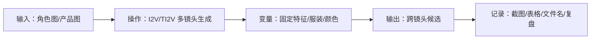

# 第 17 章：角色一致性与主体保持

> 建议时长：75-90 分钟
> 适用平台：macOS / Windows / Linux
> 本章目标：让同一角色或产品跨镜头保持可识别。

## 本章你会做成什么

| 产出 | 成功标准 |
| --- | --- |
| 主产出 | 角色参考卡和一致性检查表 |
| 操作记录 | 至少完成 2 组实例的输入、参数、截图和结果判断。 |
| 截图 | 保存到你的项目副本 `screenshots/`；课程示例图位于 `docs/assets/screenshots/chapter-17/`。 |
| 下一步输入 | 用于第 18 章编写分镜 |

## 实操验证边界

本章随仓库提供工作流、界面截图和记录表。生成结果、耗时、显存峰值和质量评分必须由学习者在自己的 ComfyUI 环境中记录；凡未完成实测的位置，一律标为 `待实测`，不得写成已生成。

## 本章截图

### I2V 角色保持模板

I2V 用参考图帮助保持角色外观。

### TI2V 角色保持模板

TI2V 可同时测试参考图和文本限制。

## 90 分钟教学安排

| 环节 | 时间 | 做什么 |
| --- | ---: | --- |
| 成果预览 | 5 分钟 | 先看截图，明确本章最后要得到什么。 |
| 原理讲解 | 15 分钟 | 讲清 角色一致性 的变量和判断标准。 |
| 实例 A 跟做 | 20 分钟 | 用基础例跑通流程。 |
| 实例 B 对比 | 20 分钟 | 只改变一个变量，观察差异。 |
| 截图记录 | 10 分钟 | 保存节点、参数、目录或项目表截图。 |
| 审阅复盘 | 10-20 分钟 | 判断是否能进入下一章。 |

## 原理图

## 显存档位建议

| 显存 | 推荐做法 | 风险控制 |
| ---: | --- | --- |
| 8GB | 只做 角色一致性 的低分辨率草稿：优先 5B、短帧数、单 seed。 | 不同时跑多个候选，不加载 14B 双阶段大模型。 |
| 12GB | 可完成 5B 完整练习；14B 只做小尺寸验证或等待 fp8/量化版本。 | 每次只改一个变量，失败先降帧数。 |
| 16GB | 可做 14B 小中尺寸流程，并保留草稿和精修两套参数。 | 先筛 seed，再提升分辨率。 |
| 24GB | 可做 角色一致性 的标准练习和 2-4 个候选对比。 | 仍要记录 seed、模型、steps、宽高、帧数、耗时。 |

## 本章使用的工作流或素材

- [5B TI2V 工作流](../assets/workflows/wan22/video_wan2_2_5B_ti2v.json)
- [14B T2V 工作流](../assets/workflows/wan22/video_wan2_2_14B_t2v.json)
- [14B I2V 工作流](../assets/workflows/wan22/video_wan2_2_14B_i2v.json)
- [14B FLF2V 工作流](../assets/workflows/wan22/video_wan2_2_14B_flf2v.json)

## 跟做实操

1. 打开 ComfyUI 首页或本章项目记录表。
2. 加载本章推荐的 Wan2.2 工作流，或打开对应截图定位节点。
3. 填写实例 A 的提示词、素材或表格。
4. 保持其他参数不动，只改变本章指定变量。
5. 运行、截图或记录缺模型错误。
6. 填写实操记录表，写出可用性判断。

## 知识点：角色参考图

参考图要清楚展示脸、发型、服装和主体比例。

### 实例：正面半身角色图

| 项目 | 内容 |
| --- | --- |
| 输入 | 一张正面半身图；提示词保留 `same hairstyle, same jacket, medium close-up`。 |
| 操作 | 用 I2V 生成室内微笑镜头。 |
| 预期现象 | 脸和服装应接近参考图。 |
| 判断原则 | 正面半身适合做身份基准。 |

操作流程：

1. 打开本章对应的 Wan2.2 工作流或项目记录表。
2. 在记录表里写下变量：`参考图=正面半身`。
3. 输入本例提示词、素材或镜头要求。
4. 按显存档位选择草稿参数；本机缺模型时记录缺失文件，不伪造输出。
5. 截图保存节点、参数或项目表，并写下本例是否可进入下一步。

### 实例：全身服装细节图

| 项目 | 内容 |
| --- | --- |
| 输入 | 一张全身角色图；提示词保留鞋子、外套颜色和包。 |
| 操作 | 生成远景行走镜头。 |
| 预期现象 | 服装轮廓预期更完整。 |
| 判断原则 | 全身图适合动作和服装一致性。 |

操作流程：

1. 打开本章对应的 Wan2.2 工作流或项目记录表。
2. 在记录表里写下变量：`参考图=全身`。
3. 输入本例提示词、素材或镜头要求。
4. 按显存档位选择草稿参数；本机缺模型时记录缺失文件，不伪造输出。
5. 截图保存节点、参数或项目表，并写下本例是否可进入下一步。

## 知识点：一致性提示词

用固定描述锁住可识别特征，避免每个镜头重新发明角色。

### 实例：固定发型服装年龄

| 项目 | 内容 |
| --- | --- |
| 输入 | `same short black hair, red jacket, early 30s, calm expression`。 |
| 操作 | 每个镜头都复制这段身份字段。 |
| 预期现象 | 跨镜头身份更稳定。 |
| 判断原则 | 身份字段应该重复使用。 |

操作流程：

1. 打开本章对应的 Wan2.2 工作流或项目记录表。
2. 在记录表里写下变量：`固定字段=人物身份`。
3. 输入本例提示词、素材或镜头要求。
4. 按显存档位选择草稿参数；本机缺模型时记录缺失文件，不伪造输出。
5. 截图保存节点、参数或项目表，并写下本例是否可进入下一步。

### 实例：固定产品颜色材质

| 项目 | 内容 |
| --- | --- |
| 输入 | `same matte black bottle, silver cap, vertical white logo`。 |
| 操作 | 每个产品镜头都保留材质和颜色字段。 |
| 预期现象 | 产品可识别性更强。 |
| 判断原则 | 产品一致性优先于复杂背景。 |

操作流程：

1. 打开本章对应的 Wan2.2 工作流或项目记录表。
2. 在记录表里写下变量：`固定字段=产品识别`。
3. 输入本例提示词、素材或镜头要求。
4. 按显存档位选择草稿参数；本机缺模型时记录缺失文件，不伪造输出。
5. 截图保存节点、参数或项目表，并写下本例是否可进入下一步。

## 知识点：跨镜头一致性评估

一致性要看首帧、中间帧、尾帧，还要跨镜头对比。

### 实例：两个室内人物镜头

| 项目 | 内容 |
| --- | --- |
| 输入 | 镜头 A：近景；镜头 B：中景；同一角色字段。 |
| 操作 | 生成后并排检查脸、服装、年龄。 |
| 预期现象 | 可判断是否像同一个人。 |
| 判断原则 | 只看单条视频不够，要跨镜头比较。 |

操作流程：

1. 打开本章对应的 Wan2.2 工作流或项目记录表。
2. 在记录表里写下变量：`评估=室内同角色`。
3. 输入本例提示词、素材或镜头要求。
4. 按显存档位选择草稿参数；本机缺模型时记录缺失文件，不伪造输出。
5. 截图保存节点、参数或项目表，并写下本例是否可进入下一步。

### 实例：室内到室外转换

| 项目 | 内容 |
| --- | --- |
| 输入 | 同一角色字段，从咖啡馆转到雨夜街道。 |
| 操作 | 只改场景字段。 |
| 预期现象 | 如果身份大变，说明场景改动过强。 |
| 判断原则 | 场景变化时身份字段更要固定。 |

操作流程：

1. 打开本章对应的 Wan2.2 工作流或项目记录表。
2. 在记录表里写下变量：`评估=跨场景`。
3. 输入本例提示词、素材或镜头要求。
4. 按显存档位选择草稿参数；本机缺模型时记录缺失文件，不伪造输出。
5. 截图保存节点、参数或项目表，并写下本例是否可进入下一步。

## 实操记录表

| 编号 | 输入素材/提示词 | 变量 | 模型/工作流 | seed | 参数 | 输出文件/表格 | 判断 |
| --- | --- | --- | --- | ---: | --- | --- | --- |
| A | 填实例 A | 只填一个核心变量 | 按本章推荐 | 固定或记录 | 草稿参数 | 运行后填写 | 可用/待修/淘汰 |
| B | 填实例 B | 与 A 形成对比 | 与 A 保持一致 | 固定或记录 | 不乱改 | 运行后填写 | 写清变化原因 |

## 截图清单

| 截图编号 | 文件 | 内容 | 状态 |
| --- | --- | --- | --- |
| 17-01 | `17-01-wan22-14b-i2v-template.webp` | I2V 角色保持模板 | 已纳入本章 |
| 17-02 | `17-02-wan22-5b-ti2v-template.webp` | TI2V 角色保持模板 | 已纳入本章 |

## 常见错误与排查

| 错误 | 常见原因 | 处理 |
| --- | --- | --- |
| 只写概念没有变量 | 不知道本章到底要验证什么。 | 每个实例只设置一个核心变量，并写入记录表。 |
| 结果失败但没有记录 | 缺少 seed、模型、提示词或截图。 | 先补记录，再决定是否重跑。 |
| 本机缺模型却写“已生成” | 伪造输出会破坏教程可信度。 | 记录缺失模型和预期输出，模型到位后再补生成截图。 |
| 参数一次改太多 | 无法判断变化来自哪里。 | 固定其他参数，只改本章变量。 |

## 本章验收清单

- [ ] 能说清 角色一致性 的核心变量。
- [ ] 完成两个实例的输入、参数、截图、结果判断和待实测记录。
- [ ] 至少保存 2 张截图。
- [ ] 如果生成失败，能说出失败是模型、显存、素材还是提示词问题。
- [ ] 写出下一章要继续使用的素材、参数或表格。

## 课后练习

1. 复制实例 A，换成你自己的项目主题。
2. 复制实例 B，只改一个变量，写出对比结论。
3. 补齐截图清单和实操记录表。
4. 写出本章最容易失败的一步，以及你的排查办法。

## 参考资料

- [ComfyUI Wan2.2 官方工作流教程](https://docs.comfy.org/tutorials/video/wan/wan2_2)
- [ComfyUI Wan2.2 示例](https://comfyanonymous.github.io/ComfyUI_examples/wan22/)
- [Wan2.2 官方仓库](https://github.com/Wan-Video/Wan2.2)
- [ComfyUI 系统需求](https://docs.comfy.org/installation/system_requirements/)

## 下一章衔接

第 18 章会把角色和镜头组织成分镜脚本。
