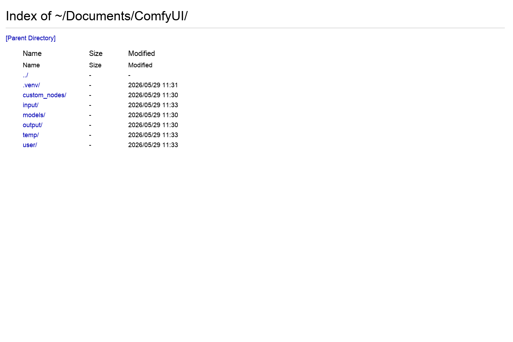
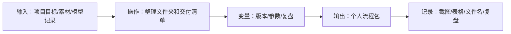

# 第 29 章：毕业作品：个人 AI 视频制作流程包

> 建议时长：90 分钟
> 适用平台：macOS / Windows / Linux
> 本章目标：把课程能力整理成可复用个人流程。

## 本章你会做成什么

| 产出 | 成功标准 |
| --- | --- |
| 主产出 | 毕业作品计划和流程包 |
| 操作记录 | 至少完成 2 组实例的输入、参数、截图和结果判断。 |
| 截图 | 保存到你的项目副本 `screenshots/`；课程示例图位于 `docs/assets/screenshots/chapter-29/`。 |
| 下一步输入 | 课程结束后可以复用这套流程做新项目 |

## 实操验证边界

本章随仓库提供工作流、界面截图和记录表。生成结果、耗时、显存峰值和质量评分必须由学习者在自己的 ComfyUI 环境中记录；凡未完成实测的位置，一律标为 `待实测`，不得写成已生成。

## 本章截图

### ComfyUI 项目目录参考

毕业包要能说明素材、模型、输出和工作流在哪里。

### 毕业项目工作流参考

最终项目应保存使用过的工作流 JSON。

## 90 分钟教学安排

| 环节 | 时间 | 做什么 |
| --- | ---: | --- |
| 成果预览 | 5 分钟 | 先看截图，明确本章最后要得到什么。 |
| 原理讲解 | 15 分钟 | 讲清 毕业流程包 的变量和判断标准。 |
| 实例 A 跟做 | 20 分钟 | 用基础例跑通流程。 |
| 实例 B 对比 | 20 分钟 | 只改变一个变量，观察差异。 |
| 截图记录 | 10 分钟 | 保存节点、参数、目录或项目表截图。 |
| 审阅复盘 | 10-20 分钟 | 判断是否能进入下一章。 |

## 原理图

## 显存档位建议

| 显存 | 推荐做法 | 风险控制 |
| ---: | --- | --- |
| 8GB | 只做 毕业流程包 的低分辨率草稿：优先 5B、短帧数、单 seed。 | 不同时跑多个候选，不加载 14B 双阶段大模型。 |
| 12GB | 可完成 5B 完整练习；14B 只做小尺寸验证或等待 fp8/量化版本。 | 每次只改一个变量，失败先降帧数。 |
| 16GB | 可做 14B 小中尺寸流程，并保留草稿和精修两套参数。 | 先筛 seed，再提升分辨率。 |
| 24GB | 可做 毕业流程包 的标准练习和 2-4 个候选对比。 | 仍要记录 seed、模型、steps、宽高、帧数、耗时。 |

## 本章使用的工作流或素材

- [本课程 Wan2.2 工作流包](../assets/workflows/wan22/)

## 跟做实操

1. 打开 ComfyUI 首页或本章项目记录表。
2. 加载本章推荐的 Wan2.2 工作流，或打开对应截图定位节点。
3. 填写实例 A 的提示词、素材或表格。
4. 保持其他参数不动，只改变本章指定变量。
5. 运行、截图或记录缺模型错误。
6. 填写实操记录表，写出可用性判断。

## 知识点：作品选题

选题决定技术路线和素材要求。

### 实例：个人品牌视觉短片

| 项目 | 内容 |
| --- | --- |
| 输入 | 主题：独立设计师个人品牌；交付：15 秒视觉短片、3 个镜头、冷暖对比。 |
| 操作 | 只测试变量 `选题=个人品牌`，其他参数保持不变。 |
| 预期现象 | 流程包包含角色/场景、提示词、输出和复盘。 |
| 判断原则 | 个人品牌选题强调风格一致。 |

操作流程：

1. 打开本章对应的 Wan2.2 工作流或项目记录表。
2. 在记录表里写下变量：`选题=个人品牌`。
3. 输入本例提示词、素材或镜头要求。
4. 按显存档位选择草稿参数；本机缺模型时记录缺失文件，不伪造输出。
5. 截图保存节点、参数或项目表，并写下本例是否可进入下一步。

### 实例：客户产品概念片

| 项目 | 内容 |
| --- | --- |
| 输入 | 主题：客户智能水杯概念片；交付：产品图、卖点镜头表、15 秒粗剪。 |
| 操作 | 只测试变量 `选题=客户产品`，其他参数保持不变。 |
| 预期现象 | 流程包能让客户看懂从卖点到镜头的过程。 |
| 判断原则 | 客户项目强调可交付和可复现。 |

操作流程：

1. 打开本章对应的 Wan2.2 工作流或项目记录表。
2. 在记录表里写下变量：`选题=客户产品`。
3. 输入本例提示词、素材或镜头要求。
4. 按显存档位选择草稿参数；本机缺模型时记录缺失文件，不伪造输出。
5. 截图保存节点、参数或项目表，并写下本例是否可进入下一步。

## 知识点：流程包装

交付的不只是成片，还包括复现材料。

### 实例：交付工作流参数

| 项目 | 内容 |
| --- | --- |
| 输入 | 交付 `workflow.json`、模型清单、seed、steps、分辨率、提示词版本。 |
| 操作 | 只测试变量 `包装=工作流参数`，其他参数保持不变。 |
| 预期现象 | 别人能按材料重跑。 |
| 判断原则 | 工作流参数是交付的一部分。 |

操作流程：

1. 打开本章对应的 Wan2.2 工作流或项目记录表。
2. 在记录表里写下变量：`包装=工作流参数`。
3. 输入本例提示词、素材或镜头要求。
4. 按显存档位选择草稿参数；本机缺模型时记录缺失文件，不伪造输出。
5. 截图保存节点、参数或项目表，并写下本例是否可进入下一步。

### 实例：交付成片素材复盘

| 项目 | 内容 |
| --- | --- |
| 输入 | 交付成片、候选素材、淘汰原因、问题截图和改进建议。 |
| 操作 | 只测试变量 `包装=成片复盘`，其他参数保持不变。 |
| 预期现象 | 项目不只交一个视频文件。 |
| 判断原则 | 复盘让下一次项目更快。 |

操作流程：

1. 打开本章对应的 Wan2.2 工作流或项目记录表。
2. 在记录表里写下变量：`包装=成片复盘`。
3. 输入本例提示词、素材或镜头要求。
4. 按显存档位选择草稿参数；本机缺模型时记录缺失文件，不伪造输出。
5. 截图保存节点、参数或项目表，并写下本例是否可进入下一步。

## 知识点：持续迭代

毕业包要能继续更新。

### 实例：根据失败更新排错

| 项目 | 内容 |
| --- | --- |
| 输入 | 把“模型缺失”“显存不足”“角色漂移”写入排错表。 |
| 操作 | 只测试变量 `迭代=排错`，其他参数保持不变。 |
| 预期现象 | 下次遇到同类错误能快速处理。 |
| 判断原则 | 失败是流程资产。 |

操作流程：

1. 打开本章对应的 Wan2.2 工作流或项目记录表。
2. 在记录表里写下变量：`迭代=排错`。
3. 输入本例提示词、素材或镜头要求。
4. 按显存档位选择草稿参数；本机缺模型时记录缺失文件，不伪造输出。
5. 截图保存节点、参数或项目表，并写下本例是否可进入下一步。

### 实例：根据反馈更新提示词

| 项目 | 内容 |
| --- | --- |
| 输入 | 客户反馈“更高级、更慢、更干净”，更新提示词 v04。 |
| 操作 | 只测试变量 `迭代=提示词`，其他参数保持不变。 |
| 预期现象 | 提示词库持续变好。 |
| 判断原则 | 反馈必须转成可执行字段。 |

操作流程：

1. 打开本章对应的 Wan2.2 工作流或项目记录表。
2. 在记录表里写下变量：`迭代=提示词`。
3. 输入本例提示词、素材或镜头要求。
4. 按显存档位选择草稿参数；本机缺模型时记录缺失文件，不伪造输出。
5. 截图保存节点、参数或项目表，并写下本例是否可进入下一步。

## 实操记录表

| 编号 | 输入素材/提示词 | 变量 | 模型/工作流 | seed | 参数 | 输出文件/表格 | 判断 |
| --- | --- | --- | --- | ---: | --- | --- | --- |
| A | 填实例 A | 只填一个核心变量 | 按本章推荐 | 固定或记录 | 草稿参数 | 运行后填写 | 可用/待修/淘汰 |
| B | 填实例 B | 与 A 形成对比 | 与 A 保持一致 | 固定或记录 | 不乱改 | 运行后填写 | 写清变化原因 |

## 截图清单

| 截图编号 | 文件 | 内容 | 状态 |
| --- | --- | --- | --- |
| 29-01 | `29-01-comfyui-base-folder.png` | ComfyUI 项目目录参考 | 已纳入本章 |
| 29-02 | `29-02-wan22-14b-flf2v-template.webp` | 毕业项目工作流参考 | 已纳入本章 |

## 常见错误与排查

| 错误 | 常见原因 | 处理 |
| --- | --- | --- |
| 只写概念没有变量 | 不知道本章到底要验证什么。 | 每个实例只设置一个核心变量，并写入记录表。 |
| 结果失败但没有记录 | 缺少 seed、模型、提示词或截图。 | 先补记录，再决定是否重跑。 |
| 本机缺模型却写“已生成” | 伪造输出会破坏教程可信度。 | 记录缺失模型和预期输出，模型到位后再补生成截图。 |
| 参数一次改太多 | 无法判断变化来自哪里。 | 固定其他参数，只改本章变量。 |

## 本章验收清单

- [ ] 能说清 毕业流程包 的核心变量。
- [ ] 完成两个实例的输入、参数、截图、结果判断和待实测记录。
- [ ] 至少保存 2 张截图。
- [ ] 如果生成失败，能说出失败是模型、显存、素材还是提示词问题。
- [ ] 写出下一章要继续使用的素材、参数或表格。

## 课后练习

1. 复制实例 A，换成你自己的项目主题。
2. 复制实例 B，只改一个变量，写出对比结论。
3. 补齐截图清单和实操记录表。
4. 写出本章最容易失败的一步，以及你的排查办法。

## 参考资料

- [ComfyUI Wan2.2 官方工作流教程](https://docs.comfy.org/tutorials/video/wan/wan2_2)
- [ComfyUI Wan2.2 示例](https://comfyanonymous.github.io/ComfyUI_examples/wan22/)
- [Wan2.2 官方仓库](https://github.com/Wan-Video/Wan2.2)
- [ComfyUI 系统需求](https://docs.comfy.org/installation/system_requirements/)

## 下一章衔接

课程结束后，继续用这套流程做真实项目。
