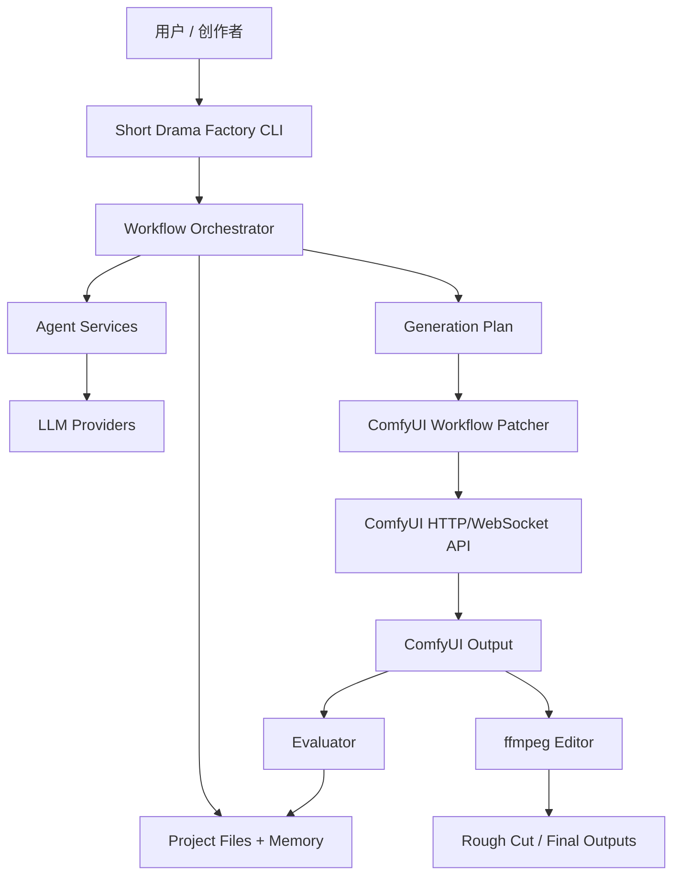

# Short Drama Factory 系统架构

## 1. 架构定位

`short-drama-factory` 是一个 CLI-first 的 AI 短剧制作编排器。它负责把多 agent 创作流程、项目文件、ComfyUI 生成后端、评分筛选和粗剪工具串起来。

系统不直接实现视频扩散模型推理。MVP 通过 ComfyUI API 或 patched workflow JSON 使用 Wan2.2 工作流完成 T2V、I2V、TI2V 和 FLF2V。

## 2. 总体拓扑



## 3. 分层架构

```text
CLI Layer
  Typer 命令、配置读取、用户确认 Gate

Application Layer
  Workflow Orchestrator、阶段推进、agent 调度、错误恢复

Domain Layer
  Project、Brief、Script、Character、Scene、Shot、Prompt、GenerationJob、Score

Agent Layer
  Producer、Script、Continuity、Shot Planner、Prompt、Asset、Evaluator、Editor

Adapter Layer
  LLM provider、ComfyUI client、Workflow patcher、ffmpeg、filesystem、SQLite

Storage Layer
  Markdown、JSON、JSONL、SQLite 可选
```

## 4. 核心运行流程

### 4.1 半自动 MVP 流程

```text
sdf init
-> sdf brief generate
-> 人工确认
-> sdf script generate
-> 人工确认
-> sdf bible generate
-> sdf shots plan
-> sdf prompts generate
-> sdf generation plan
-> sdf workflow export
-> 用户拖入 ComfyUI 手动运行
-> sdf outputs import
-> sdf evaluate
-> sdf rough-cut
```

### 4.2 自动生成流程

```text
sdf generate-shot S01_SH01
-> 加载 generation-plan.json
-> patch workflow
-> 调用 ComfyUI /prompt
-> 监听 WebSocket 或轮询 history
-> 收集输出文件
-> 写 runs.jsonl
-> 触发 evaluate
```

自动流程在 MVP 中标记为 P1，半自动流程必须先稳定。

## 5. Agent 编排

| Agent | 输入 | 输出 | Gate |
| --- | --- | --- | --- |
| Producer Agent | 创意、项目状态 | brief、阶段决策 | brief 人工确认 |
| Script Agent | brief | outline、script | 剧本人工确认 |
| Script Doctor Agent | script | 修改建议、润色版 | 可选 |
| Continuity Agent | script、brief | characters、scenes、style | bible 完整性检查 |
| Shot Planner Agent | script、bible | shot-list、shot-plan | shot-list 完整性检查 |
| Prompt Agent | shot-plan、bible | prompts | prompt 字段完整性检查 |
| Asset Agent | shot-plan | asset-plan | 缺素材阻断生成 |
| ComfyUI Agent | generation-plan | runs、outputs | ComfyUI 状态检查 |
| Evaluator Agent | outputs、shot-plan | scores、rerun advice | 一票否决检查 |
| Editor Agent | selects、shot-list | rough cut | 关键镜头存在检查 |

## 6. 数据模型

### 6.1 Project

```json
{
  "project_id": "rainy-night-001",
  "title": "雨夜归家",
  "target_duration_sec": 30,
  "backend": "comfyui",
  "workflow_preset": "wan22",
  "stage": "prompt_plan"
}
```

### 6.2 Shot

```json
{
  "shot_id": "S01_SH03",
  "purpose": "主角在公寓门口停顿",
  "duration_sec": 5,
  "workflow_type": "i2v",
  "input_assets": ["character_front_v01.png"],
  "prompt_version": "v01",
  "continuity": {
    "character_ids": ["char_linxia"],
    "scene_id": "apartment_door",
    "movement_direction": "left_to_right",
    "color_palette": "cool_blue_with_warm_door_light"
  },
  "failure_conditions": [
    "character identity changes",
    "red scarf disappears",
    "door light becomes outdoor daylight"
  ]
}
```

### 6.3 Generation Job

```json
{
  "job_id": "job_20260531_001",
  "shot_id": "S01_SH03",
  "workflow_path": "workflows/S01_SH03_i2v_v01.json",
  "seed": 102,
  "steps": 20,
  "width": 640,
  "height": 640,
  "frames": 49,
  "status": "success",
  "outputs": ["outputs/raw/S01_SH03_v01_seed102.mp4"]
}
```

## 7. 存储设计

项目包优先使用文件系统，便于版本管理和人工检查。

```text
projects/<project-id>/
  project.json
  brief.md
  brief.json
  script/
  bible/
  shots/
  inputs/
  workflows/
  outputs/
  logs/
  memory/
```

JSON/JSONL 是机器事实源，Markdown 是人类阅读层。两者同时存在时，机器执行以 JSON 为准，Markdown 用于审阅和交接。

## 8. ComfyUI 集成

### 8.1 Client

ComfyUI client 负责：

- 检查服务状态。
- 上传或引用 input 素材。
- 提交 `/prompt`。
- 监听 WebSocket 进度。
- 查询 history。
- 收集输出文件路径。

### 8.2 Workflow Patcher

Workflow patcher 负责：

- 读取课程或项目内 workflow JSON。
- 定位 prompt、negative prompt、Load Image、seed、尺寸、帧数和输出节点。
- 替换节点 widget 值。
- 输出 patched workflow JSON。
- 在节点定位失败时返回结构化错误。

### 8.3 失败分类

| 类别 | 处理 |
| --- | --- |
| `service_unavailable` | 提示启动 ComfyUI 或检查 URL。 |
| `missing_model` | 记录缺失模型文件和预期目录。 |
| `missing_node` | 记录节点类型，提示安装扩展或换工作流。 |
| `asset_missing` | 阻断生成，提示缺少参考图或首尾帧。 |
| `vram_error` | 建议降低帧数、分辨率、steps 或模型规模。 |
| `workflow_patch_error` | 保留原始 workflow，输出失败节点定位信息。 |

## 9. LLM 集成

LLM provider 使用统一接口：

```python
class LLMProvider:
    def generate(self, task: LLMTask) -> LLMResult: ...
```

MVP 支持至少一个 provider。后续可扩展 OpenAI、Anthropic、Gemini、本地模型或 Shanforge gateway。

每次 LLM 调用必须记录：

- agent 名称
- prompt 模板版本
- 输入摘要
- 输出文件路径
- provider 和模型名
- 错误信息

## 10. Memory 与 Shanforge 集成

项目本地 memory 保存当前短剧上下文：

```text
memory/current-state.md
memory/shot-status.md
memory/evolution-notes.md
```

如果项目由 Shanforge 纳管，则同步到：

```text
.factory/memory/current-state.md
.factory/memory/tasks.summary.md
.factory/memory/evolution-baseline.md
```

同步规则：

- 项目事实先写项目本地文件。
- Shanforge memory 只保存压缩摘要和跨项目经验。
- 不把大段剧本、长 prompt、视频二进制或素材复制进 `.factory/memory/`。

## 11. 观测和审计

所有关键动作写 JSONL：

```text
logs/agent-calls.jsonl
logs/runs.jsonl
logs/scores.jsonl
logs/errors.jsonl
```

每条记录至少包含：

```json
{
  "timestamp": "2026-05-31T10:00:00+08:00",
  "stage": "generation",
  "status": "success",
  "summary": "Generated S01_SH03 seed102",
  "artifacts": ["outputs/raw/S01_SH03_v01_seed102.mp4"],
  "next_actions": ["evaluate"]
}
```

## 12. 安全和权限

- 默认只访问用户指定的项目目录。
- 默认不删除输出文件，只移动或复制到 selects/rejects。
- 外部 LLM provider 必须显式配置。
- 素材授权状态进入 `asset-rights.md` 或等价 JSON。
- 自动批量生成必须显式开启，避免高成本失控。

## 13. 部署形态

MVP：

```text
本地 CLI + 本地 ComfyUI + 本地项目文件
```

后续：

```text
本地 Web UI + 远程 ComfyUI worker + 多项目数据库
```

平台化不是 MVP 前提。

