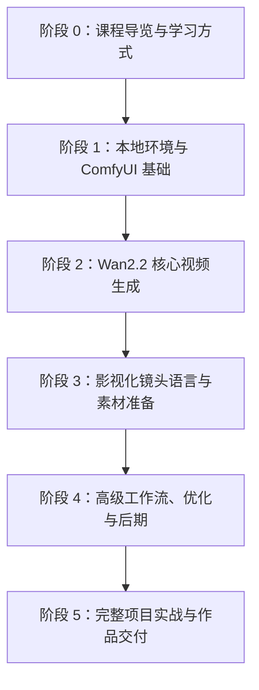
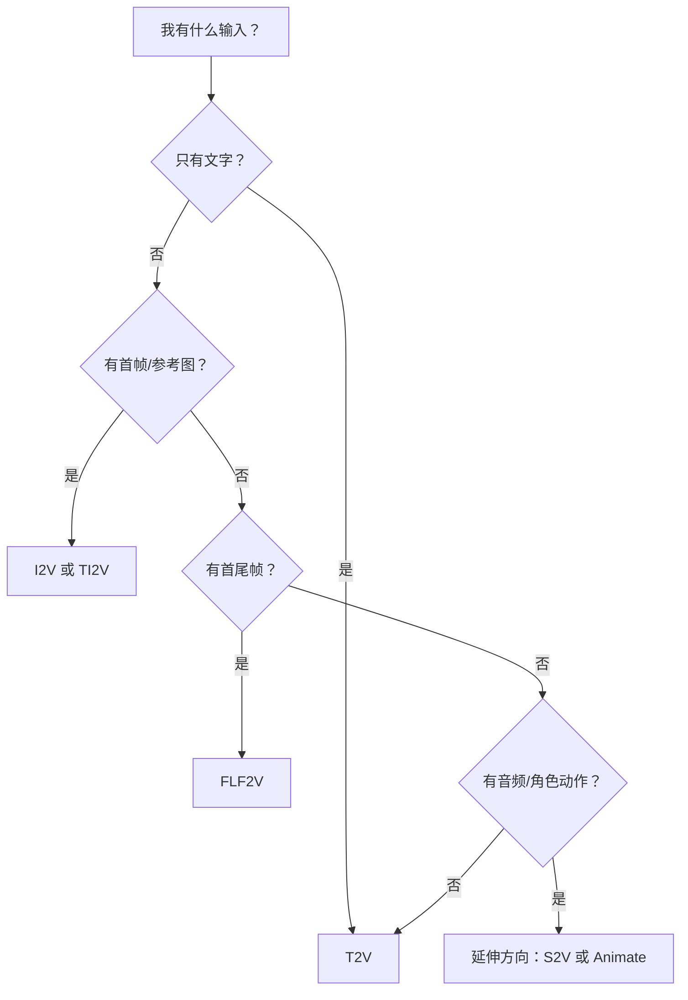

# 本地 ComfyUI + Wan2.2 AI 视频影视制作教程大纲

> 状态：出版审校中。正文草案已覆盖完整学习路径，仍需补齐真实生成结果、项目交付样例和逐章质量复核记录。
> 目标读者：零基础或少量 AI 绘图经验的创作者、剪辑师、设计师、独立导演和内容团队
> 课程目标：让学习者从本地环境搭建开始，逐步掌握 ComfyUI 与 Wan2.2 的视频生成、镜头设计、工作流调参、后期整合和项目交付，最终能独立完成可复用的 AI 视频制作流程。

## 1. 参考项目与结构借鉴

本大纲参考了 GitHub 上高星教程/学习路线项目的组织方式，但不照搬内容：

| 参考项目 | 当前观察到的结构价值 | 本课程采用方式 |
| --- | --- | --- |
| [codecrafters-io/build-your-own-x](https://github.com/codecrafters-io/build-your-own-x) | 用“动手重建一个东西”的方式学习复杂技术，项目导向强。 | 每个知识点必须有至少 2 个实操例子，避免只讲概念。 |
| [freeCodeCamp/freeCodeCamp](https://github.com/freeCodeCamp/freeCodeCamp) | 课程包含 lessons、workshops、labs、quizzes、projects 等多层练习。 | 每章设计为“原理讲解 + 跟做练习 + 对比实验 + 课后作品”。 |
| [kamranahmedse/developer-roadmap / roadmap.sh](https://github.com/kamranahmedse/developer-roadmap) | 用路线图帮助学习者知道先学什么、后学什么。 | 先给完整学习路径，再分阶段拆成 90 分钟以内的章节。 |
| [microsoft/ML-For-Beginners](https://github.com/microsoft/ML-For-Beginners) | 以周/课时为单位组织课程，并配套测验、作业、补充资源。 | 每章保留目标、时长、输出物、检查点和延伸任务。 |
| [microsoft/generative-ai-for-beginners](https://github.com/microsoft/generative-ai-for-beginners) | 将章节区分为 Learn 和 Build，并提供继续学习资源。 | 每章明确“原理知识”和“构建任务”，后续章节补充阅读和资源。 |

技术参考以官方/主源为准：

- [Wan-Video/Wan2.2](https://github.com/Wan-Video/Wan2.2)：Wan2.2 官方仓库，覆盖 T2V、I2V、TI2V、S2V、Animate 等能力。
- [ComfyUI Wan2.2 官方工作流教程](https://docs.comfy.org/tutorials/video/wan/wan2_2)：ComfyUI 官方 Wan2.2 T2V、I2V、FLF2V 模板入口。
- [ComfyUI Wan2.2 示例](https://comfyanonymous.github.io/ComfyUI_examples/wan22/)：模型文件放置、5B/14B 工作流示例和依赖文件参考。

第一版课程覆盖范围：

- 平台：同时覆盖 macOS、Windows、Linux。
- 显存：按 8GB、12GB、16GB、24GB 四档给推荐参数和降级策略。
- 实操截图：允许实际打开本机 ComfyUI 进行操作和截图；章节正文会以真实截图为准。
- Wan2.2 模型：优先覆盖官方 5B、14B T2V、14B I2V、14B FLF2V；S2V、Animate 和社区 GGUF/Wrapper 只放在延伸阅读或高阶附录。
- 后期软件：保持软件中立，只讲剪辑、补帧、放大、调色、声音、导出这些通用流程，不绑定 DaVinci Resolve、Premiere、剪映或其他单一工具。
- 交付形式：Markdown 文档为主，所有章节、图表、截图清单、工作流说明和项目复盘均优先落在仓库 Markdown 中。

## 2. 课程设计原则

1. 从入门到精通：先理解本地生成、节点图、模型文件，再进入镜头语言、角色一致性、高阶工作流和完整项目。
2. 每章不超过 90 分钟：若一个主题需要更长时间，拆成多个章节。
3. 每章遵循“原理 -> 演示 -> 实操 -> 对比 -> 复盘”的教学闭环。
4. 每个知识点至少安排 2 个实例：一个简单跟做例，一个变化/对比例。
5. 实践必须配截图：后续写章节时，每个操作步骤会标注需要截取的 ComfyUI 界面、节点图、参数面板、结果预览或错误提示。
6. 图表优先：凡涉及流程、模型选择、参数关系、镜头设计、排错路径，都使用 Mermaid 图、表格或对照图辅助解释。
7. 多平台覆盖：每个涉及安装、路径、命令、快捷键、截图的章节同时说明 macOS、Windows、Linux 差异。
8. 显存分档教学：每个涉及生成参数的章节给出 8GB、12GB、16GB、24GB 的推荐起步参数，并说明何时升级或降级。
9. 本地优先：默认以本机 ComfyUI 为主，云端只作为替代说明。
10. 影视制作导向：不仅讲“生成视频”，还讲镜头、调度、节奏、连续性、后期和交付。
11. 证据优先：任何“已生成”“已验证”“可交付”的表述必须对应截图、参数、输出文件、评分表或复盘记录；未实测内容只能标为“待实测”。
12. 商业交付优先：项目章必须包含 brief、素材清单、镜头表、生成记录、候选评分、返工记录、导出规格和 QC 清单，不能只停留在提示词示例。

## 3. 平台、显存与模型边界

### 3.1 平台覆盖策略

| 平台 | 教学覆盖重点 | 截图/命令要求 | 风险提示 |
| --- | --- | --- | --- |
| macOS | Apple Silicon / Intel 用户的安装路径、终端启动、文件目录、浏览器访问。 | 命令以 `zsh` 为主，补充 Finder 路径截图。 | Apple Silicon 的推理性能、节点兼容性和部分依赖与 CUDA 环境不同，章节中只承诺基础工作流教学。 |
| Windows | NVIDIA CUDA 用户的主路径、便携包/桌面版、模型目录、显存排查。 | 命令以 PowerShell 为主，补充资源管理器路径截图。 | 路径空格、驱动/CUDA、杀毒拦截、长路径是重点排错对象。 |
| Linux | 自部署用户的 Python/venv、GPU 驱动、服务启动、远程访问。 | 命令以 Bash 为主，补充终端和浏览器截图。 | 驱动、权限、端口、防火墙、无桌面环境是重点排错对象。 |

### 3.2 显存档位推荐参数

以下参数是课程写作和实测时的起点，不是绝对上限。章节正文会以本机 ComfyUI 实测截图和耗时记录修订。

| 显存 | 课程定位 | 优先模型 | 起步分辨率/帧数 | 典型策略 |
| ---: | --- | --- | --- | --- |
| 8GB | 入门可跑通 | 官方 Wan2.2 TI2V-5B，优先短视频草稿 | 低分辨率、短帧数、低步数 | 使用 ComfyUI native offloading；先跑通 TI2V-5B 的文本条件用法，再做小尺寸 I2V；14B 只作为演示或降级说明。 |
| 12GB | 入门到中阶 | 5B 为主，谨慎尝试 14B 低尺寸 | 低到中等分辨率、短帧数 | 先用 5B 找 seed 和提示词，再用 14B 小尺寸验证；避免批量长视频。 |
| 16GB | 中阶实操 | 5B + 14B T2V/I2V 小中尺寸 | 中等分辨率、短到中等帧数 | 可以系统学习 14B high/low noise 工作流，但仍以草稿-精选-重跑为主。 |
| 24GB | 高阶制作 | 5B + 14B T2V/I2V/FLF2V | 中高分辨率、中等帧数 | 适合做课程项目主力参数；仍保留草稿参数以节省时间。 |

### 3.3 官方模型第一版覆盖

| 模型/工作流 | 第一版定位 | 课程章节 | 说明 |
| --- | --- | --- | --- |
| Wan2.2 TI2V 5B | 入门主线模型 | 第 5、6、7、10、11 章 | 官方教程说明 5B 在 native offloading 下适合 8GB 显存，适合作为初学者首个跑通模型。 |
| Wan2.2 14B T2V | 文本生成高质量主线 | 第 6、7、8、9、13 章 | 使用 high-noise / low-noise 双模型讲解 14B 工作流和质量对比。 |
| Wan2.2 14B I2V | 图生视频主线 | 第 6、10、11、13、17、19 章 | 用人物、产品、场景参考图教学主体保持和运动控制。 |
| Wan2.2 14B FLF2V | 首尾帧控制主线 | 第 6、12、18、26、27 章 | 使用首帧/尾帧规划镜头开始和结束，服务分镜与项目实战。 |

### 3.4 后期与交付边界

- 后期软件保持中立：章节只定义素材命名、镜头筛选、时间线组织、调色思路、音频节奏、导出规格，不强制具体软件。
- Markdown 是主交付：每章输出 Markdown 正文、Mermaid 图、截图路径、参数表、提示词表、工作流文件说明。
- 截图优先来自真实操作：后续章节编写时会实际打开本机 ComfyUI，按章节截图清单采集素材。

## 4. 建议文档结构

后续确认后，建议按以下结构逐章落地：

```text
docs/
  course-outline.md
  00-course-guide/
  01-foundation/
  02-wan22-core/
  03-cinematic-language/
  04-advanced-workflows/
  05-production-projects/
  assets/
    screenshots/
    diagrams/
    workflows/
    prompts/
```

章节正文建议统一模板：

```text
# 章节标题
## 学习目标
## 本章产出
## 90 分钟教学安排
## 原理讲解
## 平台差异：macOS / Windows / Linux
## 显存档位：8GB / 12GB / 16GB / 24GB
## 知识点 1：说明 + 实例 A + 实例 B
## 知识点 2：说明 + 实例 A + 实例 B
## 跟做实操
## 截图清单
## 常见错误与排查
## 课后练习
## 下一章衔接
```

## 5. 总体学习路线



## 6. 大纲总览

| 阶段 | 章节数 | 核心目标 | 阶段成果 |
| --- | ---: | --- | --- |
| 阶段 0：课程导览 | 1 | 明确学习路径、硬件边界、作品标准 | 完成个人学习环境检查表 |
| 阶段 1：本地环境与 ComfyUI 基础 | 6 | 会安装、会加载模型、会读节点图、会保存工作流 | 创建第一个项目并生成第一段短视频测试 |
| 阶段 2：Wan2.2 核心视频生成 | 7 | 掌握 T2V、I2V、TI2V、FLF2V、参数对比和质量判断 | 完成 4 类基础视频工作流 |
| 阶段 3：影视化镜头语言与素材准备 | 6 | 把“提示词”升级成镜头设计、分镜、构图和连续性控制 | 完成一组 6 镜头短片分镜 |
| 阶段 4：高级工作流、优化与后期 | 6 | 学会改工作流、低显存优化、风格控制、后期整合和排错 | 形成个人可复用工作流模板 |
| 阶段 5：完整项目实战 | 4 | 用项目串联前面知识 | 完成 3 个短片项目和一个毕业作品方案 |

总计：29 个正式章节 + 1 个零基础实操入口，单章 45-90 分钟，总教学时长约 36-42 小时。

## 7. 逐章实施分析

| 章节 | 修订后的逐章分析 |
| --- | --- |
| 第 0 章 | 用来统一学习边界：三平台都要记录系统、GPU/显存、Python/ComfyUI 版本；建立 8GB/12GB/16GB/24GB 学习路径；明确 Markdown 目录、截图目录和作品目录。 |
| 第 0 实操入口 | 用来补足零基础上手断点：把打开 ComfyUI、创建项目、下载 5B 模型、放置文件、拖入 JSON、填写提示词和点击运行串成一条可执行路线。 |
| 第 1 章 | 原理章不依赖平台，但要把 VAE、文本编码器、扩散模型、high/low noise 双阶段与 5B/14B 的关系讲清，避免初学者把模型文件当成黑盒。 |
| 第 2 章 | 平台差异最大：macOS、Windows、Linux 分别写安装入口、启动命令、路径和常见错误；截图必须覆盖启动日志、本地地址、模型目录。 |
| 第 3 章 | 重点分析 ComfyUI 通用界面，不绑定操作系统；要补充 macOS `Cmd` 与 Windows/Linux `Ctrl` 快捷键差异，并用截图标注节点、端口、队列、预览。 |
| 第 4 章 | 显存分档核心章：建立 8GB/12GB/16GB/24GB 参数建议表；分别解释 5B、14B T2V、14B I2V、FLF2V 所需模型文件和目录。 |
| 第 5 章 | 第一次跑通优先使用官方 5B；8GB 用户必须能完成低尺寸短帧数测试，12GB/16GB/24GB 用户再逐步提升参数；截图记录完整跑通证据。 |
| 第 6 章 | 模型选择决策章：第一版只把官方 5B、14B T2V、14B I2V、FLF2V 作为主线；S2V/Animate/社区 GGUF 作为延伸，不进入核心实操。 |
| 第 7 章 | T2V 章节分两层：8GB 从 TI2V-5B 的文本条件用法入门，16GB/24GB 增加 14B T2V 对比；每个提示词知识点都要有两个视频样例。 |
| 第 8 章 | 提示词模板需要跨模型可复用：先在 5B 上快速验证，再在 14B T2V 上观察质量提升；截图重点是提示词版本和输出对比。 |
| 第 9 章 | 参数实验章必须按显存档位拆表：低显存只做 seed/steps 小矩阵，高显存增加分辨率和帧数；不承诺所有显卡都能跑同一参数。 |
| 第 10 章 | I2V 主线要覆盖 5B/TI2V 入门和 14B I2V 高质量路径；人物图、产品图两个实例必须都保留，截图突出参考图输入和主体保持。 |
| 第 11 章 | TI2V 教学强调图像控制外观、文本控制运动和氛围；8GB 以 5B 为主，14B I2V/T2V 的组合只作为高显存对比。 |
| 第 12 章 | FLF2V 是第一版重点模型之一；教学要从小尺寸首尾帧过渡开始，再给 16GB/24GB 的更高质量参数；截图必须包含首帧、尾帧、输出关键帧。 |
| 第 13 章 | 质量评估要软件中立，不依赖特定播放器或剪辑软件；评分表使用 Markdown 表格，按画面、运动、主体、剪辑可用性打分。 |
| 第 14 章 | 镜头语言跨平台无差异，重点是把影视术语变成提示词字段；两个实例分别覆盖人物镜头和环境镜头，并保留 T2V/I2V 两种路径。 |
| 第 15 章 | 构图、光线、色彩要用图表和结果对照讲，不绑定后期软件；截图应截同一模型、同一 seed、不同视觉字段的输出。 |
| 第 16 章 | 动作设计要和显存无强绑定，但高动作幅度会增加失败率；低显存先做小动作，高显存再测试复杂运动，逐章记录失败帧。 |
| 第 17 章 | 角色一致性优先用 I2V/TI2V 和参考卡，不引入额外插件作为第一路径；高阶扩展只在后续章节补充。 |
| 第 18 章 | 分镜章节是 Markdown 主交付的核心：用表格记录镜头号、输入素材、模型、显存档位参数、截图路径和输出文件。 |
| 第 19 章 | 素材准备要平台中立：只规定图片质量、命名、目录和首尾帧要求；后续截图来自文件夹结构、输入节点和素材对比。 |
| 第 20 章 | 工作流修改章要按官方工作流开始，不先引入社区节点；三平台截图一致，主要展示节点分区、参数暴露和保存 JSON。 |
| 第 21 章 | 低显存优化章专门服务 8GB/12GB 用户；16GB/24GB 也要学习草稿参数，因为项目实战需要批量筛选。 |
| 第 22 章 | 风格控制和扩展节点仍保留，但第一版降低优先级；先讲提示词和官方模型，再讲 LoRA/扩展节点的记录、回滚和冲突风险。 |
| 第 23 章 | 后期章保持软件中立：用通用时间线、镜头筛选、补帧、放大、调色、声音概念；截图可以来自任意可用软件，但正文不依赖某个软件按钮。 |
| 第 24 章 | 可复现项目管理全部落到 Markdown：记录模型文件、seed、提示词、参数、截图、工作流 JSON、输出文件和失败原因。 |
| 第 25 章 | 批量实验按显存档位设计：8GB 做少量 seed，12GB/16GB 做参数矩阵，24GB 做候选镜头批量；结果以 Markdown 评分表沉淀。 |
| 第 26 章 | 产品广告项目优先覆盖 5B 快速预览 + 14B I2V/FLF2V 精修；保持后期软件中立，只要求交付镜头表、素材表、粗剪说明。 |
| 第 27 章 | 叙事短片项目重点验证角色一致性和镜头连续性；三平台差异只体现在生成命令和素材路径，创作流程保持一致。 |
| 第 28 章 | 音乐/预告片混剪只讲节奏和素材组织，不绑定具体剪辑软件；Markdown 中记录音乐节拍、镜头长度、素材版本和导出参数。 |
| 第 29 章 | 毕业作品整理成可复用 Markdown 项目包：包含平台说明、显存参数、工作流 JSON、提示词库、截图索引、素材清单和复盘。 |

## 8. 阶段 0：课程导览与学习方式

### 第 0 章：课程地图、学习成果与本地制作边界

- 正文文件：[docs/00-course-guide/chapter-00-course-map.md](00-course-guide/chapter-00-course-map.md)
- 当前状态：出版修订中。
- 预计时长：45-60 分钟
- 原理目标：理解 AI 视频制作不是单次生成，而是“模型 + 工作流 + 镜头设计 + 后期”的系统过程。
- 实操目标：完成学习环境与硬件信息记录。
- 本章产出：个人学习检查表、显卡/内存/磁盘记录、课程作品目标。

知识点与双实例：

- 知识点 1：本地 AI 视频制作流程
  实例 A：文字生成 5 秒镜头的最小流程。
  实例 B：参考图生成 5 秒镜头的最小流程。
- 知识点 2：课程作品标准
  实例 A：社媒产品短片的验收标准。
  实例 B：叙事短片镜头组的验收标准。
- 知识点 3：硬件与时间成本
  实例 A：消费级显卡低分辨率预览流程。
  实例 B：高质量输出的长时间渲染流程。

图表规划：


截图规划：系统信息、ComfyUI 启动页、后续作品目录结构。

## 9. 阶段 1：本地环境与 ComfyUI 基础

### 第 0 实操入口：从零创建第一个 ComfyUI + Wan2.2 项目

- 正文文件：[docs/01-foundation/chapter-00-zero-to-first-project.md](01-foundation/chapter-00-zero-to-first-project.md)
- 当前状态：待实测补图/待产出验证。
- 预计时长：60-90 分钟
- 原理目标：不讲抽象原理，先把 ComfyUI 基础目录、项目目录、模型目录和工作流 JSON 的关系说清。
- 实操目标：完成第一个 `wan22-first-project` 项目目录，下载并放置 5B 最小模型，拖入 JSON，填写第一次提示词并点击运行。
- 本章产出：一个含 `inputs/`、`outputs/`、`workflows/`、`screenshots/`、`notes/` 的项目文件夹。

知识点与双实例：

- 知识点 1：ComfyUI 软件目录与个人项目目录的区别。
  实例 A：把模型放到 ComfyUI `models/`。
  实例 B：把项目素材和记录放到个人项目目录。
- 知识点 2：Wan2.2 5B 最小模型下载和放置。
  实例 A：下载 5B diffusion、VAE、text encoder 三个文件。
  实例 B：根据缺模型错误回查应该放到哪个目录。
- 知识点 3：第一次运行链路。
  实例 A：拖入课程 JSON 并选择课程参考图。
  实例 B：运行成功或失败都写入项目记录。

截图规划：ComfyUI 首页、项目目录树、模型目录、LoadImage 节点、运行按钮、输出或错误截图。

### 第 1 章：AI 视频生成基本原理

- 正文文件：[docs/01-foundation/chapter-01-ai-video-principles.md](01-foundation/chapter-01-ai-video-principles.md)
- 当前状态：出版修订中。
- 预计时长：75-90 分钟
- 原理目标：理解扩散模型、潜空间、采样、VAE、文本编码器和视频帧序列的基本关系。
- 实操目标：用图像生成的类比理解视频生成。
- 本章产出：一张“从提示词到视频”的流程图。

知识点与双实例：

- 知识点 1：扩散与去噪
  实例 A：从噪声到静态图像的概念示意。
  实例 B：从噪声序列到连续视频帧的概念示意。
- 知识点 2：潜空间与 VAE
  实例 A：图像编码/解码为何影响清晰度。
  实例 B：视频 VAE 为何影响运动和压缩效率。
- 知识点 3：文本条件与图像条件
  实例 A：纯文字控制“雨夜街道”。
  实例 B：参考图控制“同一街道开始动起来”。

截图规划：ComfyUI 节点图中的模型加载、文本编码、采样、VAE 解码节点。

### 第 2 章：安装 ComfyUI 与启动本地服务

- 正文文件：[docs/01-foundation/chapter-02-install-comfyui-local-service.md](01-foundation/chapter-02-install-comfyui-local-service.md)
- 当前状态：待实测补图/待产出验证。
- 预计时长：60-90 分钟
- 原理目标：理解本地服务、Python 环境、依赖、模型目录的关系。
- 实操目标：完成 ComfyUI 启动并打开浏览器界面。
- 本章产出：可访问的本地 ComfyUI 页面。

知识点与双实例：

- 知识点 1：本地服务与浏览器界面
  实例 A：通过默认地址访问 ComfyUI。
  实例 B：端口被占用时更换端口或排查进程。
- 知识点 2：项目目录与模型目录
  实例 A：把 VAE 放入 `models/vae/`。
  实例 B：把 diffusion model 放入 `models/diffusion_models/`。
- 知识点 3：启动日志阅读
  实例 A：正常加载模型的日志。
  实例 B：缺少依赖或模型路径错误的日志。

截图规划：终端启动日志、浏览器首页、目录结构、错误日志示例。

### 第 3 章：ComfyUI 界面与节点图基础

- 正文文件：[docs/01-foundation/chapter-03-comfyui-interface-and-nodes.md](01-foundation/chapter-03-comfyui-interface-and-nodes.md)
- 当前状态：待实测补图/待产出验证。
- 预计时长：75-90 分钟
- 原理目标：理解节点、连线、数据类型、队列、预览和保存。
- 实操目标：能读懂最简单的生成工作流。
- 本章产出：一份标注过的基础节点图截图。

知识点与双实例：

- 知识点 1：节点图的数据流
  实例 A：文本 -> 采样器 -> 图像输出。
  实例 B：图像输入 -> 采样器 -> 视频输出。
- 知识点 2：参数输入与输出端口
  实例 A：正向提示词和负向提示词的输入。
  实例 B：latent、image、conditioning 不同连接类型。
- 知识点 3：队列与执行状态
  实例 A：单任务排队生成。
  实例 B：批量任务连续生成并比较结果。

截图规划：节点端口、队列按钮、执行进度、预览窗口、保存文件位置。

### 第 4 章：模型文件、显存与存储管理

- 正文文件：[docs/01-foundation/chapter-04-model-files-vram-storage.md](01-foundation/chapter-04-model-files-vram-storage.md)
- 当前状态：待实测补图/待产出验证。
- 预计时长：75-90 分钟
- 原理目标：理解模型文件类型、精度、显存、内存、磁盘缓存的关系。
- 实操目标：建立稳定的模型目录和命名规范。
- 本章产出：本机模型清单表。

知识点与双实例：

- 知识点 1：模型文件类型
  实例 A：Wan2.2 5B TI2V 模型文件放置。
  实例 B：Wan2.2 14B high/low noise 双模型放置。
- 知识点 2：显存压力来源
  实例 A：分辨率升高导致显存上涨。
  实例 B：帧数增加导致耗时和内存压力上涨。
- 知识点 3：文件命名与版本管理
  实例 A：官方模型按来源命名。
  实例 B：测试模型按日期、精度、用途命名。

截图规划：模型目录、文件名、加载节点下拉框、显存错误或加载失败提示。

### 第 5 章：第一次生成：从静态图到短视频测试

- 正文文件：[docs/01-foundation/chapter-05-first-generation-image-to-short-video.md](01-foundation/chapter-05-first-generation-image-to-short-video.md)
- 当前状态：待实测补图/待产出验证。
- 预计时长：75-90 分钟
- 原理目标：理解“先跑通，再追求质量”的实验顺序。
- 实操目标：导入官方/示例工作流，完成第一段短视频。
- 本章产出：第一段可播放的视频和对应工作流 JSON。

知识点与双实例：

- 知识点 1：导入工作流
  实例 A：从模板菜单加载 Wan2.2 工作流。
  实例 B：拖入 JSON 或带工作流信息的媒体文件。
- 知识点 2：最小可运行参数
  实例 A：低分辨率、短帧数快速测试。
  实例 B：同提示词提高分辨率进行质量对比。
- 知识点 3：输出文件管理
  实例 A：按日期保存测试视频。
  实例 B：按项目镜头编号保存输出。

截图规划：模板入口、导入后的节点图、队列执行、输出视频文件夹。

## 10. 阶段 2：Wan2.2 核心视频生成

### 第 6 章：Wan2.2 模型家族与任务选择

- 正文文件：[docs/02-wan22-core/chapter-06-wan22-model-family-task-selection.md](02-wan22-core/chapter-06-wan22-model-family-task-selection.md)
- 当前状态：待实测补图/待产出验证。
- 预计时长：60-90 分钟
- 原理目标：理解官方 5B、14B T2V、14B I2V、FLF2V 的适用场景，并知道 S2V、Animate 属于后续延伸方向。
- 实操目标：能根据需求、输入素材和显存档位选择第一版课程内的合适模型和工作流。
- 本章产出：Wan2.2 任务选择决策表。

知识点与双实例：

- 知识点 1：任务类型选择
  实例 A：只有创意文本时选择 T2V。
  实例 B：已有角色图或产品图时选择 I2V/TI2V。
- 知识点 2：5B 与 14B 的取舍
  实例 A：5B 用于快速预览和低门槛学习。
  实例 B：14B 用于更高质量镜头输出。
- 知识点 3：高噪声/低噪声阶段
  实例 A：14B T2V 的 high/low noise 模型加载。
  实例 B：14B I2V 的 high/low noise 模型加载。

图表规划：



截图规划：官方 5B、14B T2V、14B I2V、FLF2V 工作流入口，模型加载节点，模型选择下拉框。

### 第 7 章：T2V 文本生成视频基础

- 正文文件：[docs/02-wan22-core/chapter-07-t2v-text-to-video-basics.md](02-wan22-core/chapter-07-t2v-text-to-video-basics.md)
- 当前状态：待实测补图/待产出验证。
- 预计时长：75-90 分钟
- 原理目标：理解纯文本如何约束主体、动作、场景、镜头和风格。
- 实操目标：完成两组 T2V 短镜头。
- 本章产出：2 段 T2V 视频和提示词对照表。

知识点与双实例：

- 知识点 1：提示词基础结构
  实例 A：人物 + 动作 + 场景。
  实例 B：物体 + 运动 + 环境。
- 知识点 2：镜头描述
  实例 A：固定镜头拍摄雨夜街道。
  实例 B：缓慢推镜拍摄未来城市。
- 知识点 3：风格描述
  实例 A：纪录片自然光风格。
  实例 B：电影预告片高反差风格。

截图规划：提示词节点、生成参数、两个输出视频的对比预览。

### 第 8 章：提示词工程：从描述到可控镜头

- 正文文件：[docs/02-wan22-core/chapter-08-prompt-engineering-controllable-shot.md](02-wan22-core/chapter-08-prompt-engineering-controllable-shot.md)
- 当前状态：待实测补图/待产出验证。
- 预计时长：75-90 分钟
- 原理目标：把自然语言描述拆成可控字段。
- 实操目标：建立提示词模板并进行 2 轮迭代。
- 本章产出：个人提示词模板库 v1。

知识点与双实例：

- 知识点 1：提示词字段化
  实例 A：人物广告镜头模板。
  实例 B：风景空镜模板。
- 知识点 2：负向提示词
  实例 A：减少畸形肢体和画面脏点。
  实例 B：减少错误文字和标志。
- 知识点 3：迭代修改
  实例 A：只改动作词，观察运动变化。
  实例 B：只改光线词，观察氛围变化。

截图规划：提示词版本对照、队列历史、结果网格对比。

### 第 9 章：采样参数、种子、步数与分辨率

- 正文文件：[docs/02-wan22-core/chapter-09-sampling-seed-steps-resolution.md](02-wan22-core/chapter-09-sampling-seed-steps-resolution.md)
- 当前状态：待实测补图/待产出验证。
- 预计时长：75-90 分钟
- 原理目标：理解 seed、steps、cfg、分辨率、帧数对质量和耗时的影响。
- 实操目标：完成参数矩阵测试。
- 本章产出：一张参数实验表和推荐默认值。

知识点与双实例：

- 知识点 1：seed 与可复现
  实例 A：固定 seed 只改提示词。
  实例 B：固定提示词只改 seed。
- 知识点 2：steps 与质量/耗时
  实例 A：低步数快速草稿。
  实例 B：高步数精修输出。
- 知识点 3：分辨率与帧数
  实例 A：低分辨率短帧数预览。
  实例 B：高分辨率长帧数最终输出。

图表规划：参数变化对质量、速度、显存的影响矩阵。

截图规划：参数面板、不同 seed 输出、不同 steps 输出、任务耗时记录。

### 第 10 章：I2V 图生视频：让一张图动起来

- 正文文件：[docs/02-wan22-core/chapter-10-i2v-make-image-move.md](02-wan22-core/chapter-10-i2v-make-image-move.md)
- 当前状态：待实测补图/待产出验证。
- 预计时长：75-90 分钟
- 原理目标：理解参考图如何约束主体外观、构图和初始状态。
- 实操目标：用人物图和产品图分别生成短视频。
- 本章产出：2 段 I2V 视频和参考图准备清单。

知识点与双实例：

- 知识点 1：参考图质量
  实例 A：清晰人像生成轻微表情和镜头运动。
  实例 B：产品海报生成旋转展示。
- 知识点 2：动作提示词
  实例 A：人物转头、眨眼、微笑。
  实例 B：产品悬浮、光线扫过、慢速旋转。
- 知识点 3：构图保持
  实例 A：锁定半身人物构图。
  实例 B：锁定产品居中构图。

截图规划：上传参考图、图像输入节点、I2V 模型加载、结果对比。

### 第 11 章：TI2V 混合输入：文本与图像共同控制

- 正文文件：[docs/02-wan22-core/chapter-11-ti2v-text-image-control.md](02-wan22-core/chapter-11-ti2v-text-image-control.md)
- 当前状态：待实测补图/待产出验证。
- 预计时长：75-90 分钟
- 原理目标：理解图像控制“长什么样”，文本控制“怎么动、什么氛围”。
- 实操目标：同一参考图做两种文本方向。
- 本章产出：2 组 TI2V 对比视频。

知识点与双实例：

- 知识点 1：图像和文本权重的实际表现
  实例 A：同一角色生成温柔生活感镜头。
  实例 B：同一角色生成科幻战斗感镜头。
- 知识点 2：风格迁移边界
  实例 A：保持产品外观，只改变灯光。
  实例 B：保持人物身份，只改变场景氛围。
- 知识点 3：失败案例判断
  实例 A：文本过强导致参考图丢失。
  实例 B：参考图质量差导致动作不稳定。

截图规划：同图不同提示词的节点设置、结果对照、失败案例标注。

### 第 12 章：FLF2V 首尾帧视频：控制开始与结束

- 正文文件：[docs/02-wan22-core/chapter-12-flf2v-first-last-frame.md](02-wan22-core/chapter-12-flf2v-first-last-frame.md)
- 当前状态：待实测补图/待产出验证。
- 预计时长：75-90 分钟
- 原理目标：理解首帧、尾帧、过渡运动和画面连续性。
- 实操目标：制作两个首尾帧过渡镜头。
- 本章产出：2 段首尾帧过渡视频。

知识点与双实例：

- 知识点 1：首尾帧设计
  实例 A：产品从关闭到点亮。
  实例 B：角色从正脸到侧脸。
- 知识点 2：过渡描述
  实例 A：平滑推镜过渡。
  实例 B：快速运动转场。
- 知识点 3：连续性问题
  实例 A：主体形变的排查。
  实例 B：背景跳变的排查。

截图规划：首帧/尾帧输入节点、两张输入图、输出视频关键帧对比。

### 第 13 章：质量评估与批量对比

- 正文文件：[docs/02-wan22-core/chapter-13-quality-evaluation-batch-comparison.md](02-wan22-core/chapter-13-quality-evaluation-batch-comparison.md)
- 当前状态：待实测补图/待产出验证。
- 预计时长：75-90 分钟
- 原理目标：建立视频生成结果的评估标准。
- 实操目标：用同一提示词生成多版本并打分。
- 本章产出：视频质量评分表。

知识点与双实例：

- 知识点 1：画面质量评估
  实例 A：人物面部稳定性评分。
  实例 B：产品轮廓和文字稳定性评分。
- 知识点 2：运动质量评估
  实例 A：慢动作镜头是否自然。
  实例 B：快速动作是否破碎或拖影。
- 知识点 3：可用性评估
  实例 A：可直接剪进短片的镜头。
  实例 B：只能作为灵感草稿的镜头。

截图规划：多版本输出文件夹、对比网格、评分表填写示例。

## 11. 阶段 3：影视化镜头语言与素材准备

### 第 14 章：镜头语言基础：景别、机位与运动

- 正文文件：[docs/03-cinematic-language/chapter-14-shot-language-scale-angle-motion.md](03-cinematic-language/chapter-14-shot-language-scale-angle-motion.md)
- 当前状态：待实测补图/待产出验证。
- 预计时长：75-90 分钟
- 原理目标：把影视术语转换成 AI 可理解的提示词。
- 实操目标：同一主题生成不同景别和运动。
- 本章产出：镜头语言提示词词库。

知识点与双实例：

- 知识点 1：景别
  实例 A：近景人物情绪镜头。
  实例 B：远景城市环境镜头。
- 知识点 2：机位
  实例 A：低机位英雄感。
  实例 B：俯拍孤独感。
- 知识点 3：镜头运动
  实例 A：dolly in 推进。
  实例 B：pan 横摇展示空间。

截图规划：不同景别结果对比、提示词标注图。

### 第 15 章：构图、光线与色彩

- 正文文件：[docs/03-cinematic-language/chapter-15-composition-light-color.md](03-cinematic-language/chapter-15-composition-light-color.md)
- 当前状态：待实测补图/待产出验证。
- 预计时长：75-90 分钟
- 原理目标：理解构图、光线、色彩如何影响视频质感。
- 实操目标：制作两组“同内容不同视觉风格”的镜头。
- 本章产出：视觉风格对照表。

知识点与双实例：

- 知识点 1：构图
  实例 A：中心构图的产品镜头。
  实例 B：三分法构图的人物镜头。
- 知识点 2：光线
  实例 A：柔和自然光。
  实例 B：强反差轮廓光。
- 知识点 3：色彩
  实例 A：冷色科幻风。
  实例 B：暖色复古风。

截图规划：构图参考图、光线提示词对照、色彩输出对照。

### 第 16 章：动作设计与运动可控性

- 正文文件：[docs/03-cinematic-language/chapter-16-action-design-motion-control.md](03-cinematic-language/chapter-16-action-design-motion-control.md)
- 当前状态：待实测补图/待产出验证。
- 预计时长：75-90 分钟
- 原理目标：理解动作幅度、速度、方向和镜头运动之间的冲突。
- 实操目标：设计稳定的小动作与大动作镜头。
- 本章产出：动作提示词风险表。

知识点与双实例：

- 知识点 1：低风险动作
  实例 A：人物眨眼、微笑、转头。
  实例 B：产品慢速旋转、光线滑过。
- 知识点 2：高风险动作
  实例 A：跳跃、奔跑、转身导致肢体错误。
  实例 B：复杂机械变形导致结构错误。
- 知识点 3：动作与镜头的组合
  实例 A：主体静止、镜头移动。
  实例 B：主体移动、镜头固定。

截图规划：低风险与高风险动作输出对比、失败帧标注。

### 第 17 章：角色一致性与主体保持

- 正文文件：[docs/03-cinematic-language/chapter-17-character-consistency-subject-hold.md](03-cinematic-language/chapter-17-character-consistency-subject-hold.md)
- 当前状态：待实测补图/待产出验证。
- 预计时长：75-90 分钟
- 原理目标：理解角色一致性的来源和限制。
- 实操目标：让同一角色出现在两个不同镜头中。
- 本章产出：角色参考卡和一致性检查表。

知识点与双实例：

- 知识点 1：角色参考图
  实例 A：正面半身角色图。
  实例 B：带服装细节的全身角色图。
- 知识点 2：一致性提示词
  实例 A：固定发型、服装、年龄。
  实例 B：固定产品颜色、材质、标识。
- 知识点 3：跨镜头一致性评估
  实例 A：两个室内人物镜头对比。
  实例 B：室内到室外场景转换对比。

截图规划：角色参考卡、两个镜头首帧/尾帧对照、差异标注。

### 第 18 章：分镜脚本与镜头清单

- 正文文件：[docs/03-cinematic-language/chapter-18-storyboard-shot-list.md](03-cinematic-language/chapter-18-storyboard-shot-list.md)
- 当前状态：待实测补图/待产出验证。
- 预计时长：75-90 分钟
- 原理目标：将创意拆成镜头，而不是一次性生成整部片。
- 实操目标：为 30 秒短片设计 6 个镜头。
- 本章产出：分镜表、镜头提示词表。

知识点与双实例：

- 知识点 1：镜头拆分
  实例 A：产品广告拆成开场、细节、使用、情绪、卖点、收束。
  实例 B：叙事片段拆成环境、人物、动作、反应、转折、结尾。
- 知识点 2：镜头时长
  实例 A：社媒快节奏 2-4 秒镜头。
  实例 B：氛围短片 4-6 秒镜头。
- 知识点 3：连续性规划
  实例 A：同一方向运动保证剪辑顺畅。
  实例 B：同一色彩风格保证视觉统一。

图表规划：从脚本到镜头清单的拆解图。

截图规划：分镜表、每个镜头的参考图占位、提示词表。

### 第 19 章：参考图与素材准备

- 正文文件：[docs/03-cinematic-language/chapter-19-reference-image-asset-preparation.md](03-cinematic-language/chapter-19-reference-image-asset-preparation.md)
- 当前状态：待实测补图/待产出验证。
- 预计时长：75-90 分钟
- 原理目标：理解输入素材质量对 I2V/TI2V/FLF2V 的影响。
- 实操目标：准备角色、产品、场景三类素材。
- 本章产出：素材准备规范和样例目录。

知识点与双实例：

- 知识点 1：参考图清晰度
  实例 A：高清产品图生成稳定旋转。
  实例 B：低清截图导致细节漂移。
- 知识点 2：背景复杂度
  实例 A：简单背景更容易保持主体。
  实例 B：复杂街景更容易出现跳变。
- 知识点 3：首尾帧素材
  实例 A：同构图首尾帧做平滑过渡。
  实例 B：构图差异大导致变形或硬转场。

截图规划：素材目录、合格/不合格参考图对照、输入节点预览。

## 12. 阶段 4：高级工作流、优化与后期

### 第 20 章：读懂并修改 ComfyUI 工作流

- 正文文件：[docs/04-advanced-workflows/chapter-20-read-modify-comfyui-workflow.md](04-advanced-workflows/chapter-20-read-modify-comfyui-workflow.md)
- 当前状态：待实测补图/待产出验证。
- 预计时长：75-90 分钟
- 原理目标：理解工作流不是黑盒，可以逐段拆解。
- 实操目标：修改一个官方工作流并保存个人版本。
- 本章产出：个人 Wan2.2 基础工作流模板。

知识点与双实例：

- 知识点 1：工作流分区
  实例 A：模型加载区。
  实例 B：采样和输出区。
- 知识点 2：替换节点
  实例 A：替换输出保存节点。
  实例 B：替换预览或尺寸调整节点。
- 知识点 3：参数暴露
  实例 A：把常改 seed、steps 放到显眼位置。
  实例 B：把镜头编号、输出路径整理成项目参数。

截图规划：官方原始工作流、修改后的分区工作流、保存 JSON。

### 第 21 章：低显存与速度优化

- 正文文件：[docs/04-advanced-workflows/chapter-21-low-vram-speed-optimization.md](04-advanced-workflows/chapter-21-low-vram-speed-optimization.md)
- 当前状态：待实测补图/待产出验证。
- 预计时长：75-90 分钟
- 原理目标：理解显存、精度、offload、分辨率、批量任务之间的取舍。
- 实操目标：建立低显存测试流程。
- 本章产出：本机推荐参数表。

知识点与双实例：

- 知识点 1：降低显存占用
  实例 A：降低分辨率和帧数。
  实例 B：使用更轻量模型或低精度模型。
- 知识点 2：速度优化
  实例 A：先用草稿参数快速筛选 seed。
  实例 B：只对候选 seed 做高质量重跑。
- 知识点 3：失败恢复
  实例 A：显存不足时缩小任务。
  实例 B：节点报错时定位模型缺失或路径错误。

截图规划：显存占用、失败日志、优化前后耗时对比。

### 第 22 章：风格控制、LoRA 与扩展节点

- 正文文件：[docs/04-advanced-workflows/chapter-22-style-control-lora-extensions.md](04-advanced-workflows/chapter-22-style-control-lora-extensions.md)
- 当前状态：待实测补图/待产出验证。
- 预计时长：75-90 分钟
- 原理目标：理解风格增强和扩展节点的收益与风险。
- 实操目标：建立“先官方工作流、再扩展”的安全试验流程。
- 本章产出：扩展节点记录表。

知识点与双实例：

- 知识点 1：风格控制边界
  实例 A：通过提示词控制电影感。
  实例 B：通过 LoRA 或风格模型增强特定画风。
- 知识点 2：扩展节点管理
  实例 A：安装一个常用辅助节点并记录来源。
  实例 B：禁用扩展节点排查冲突。
- 知识点 3：版本风险
  实例 A：ComfyUI 更新后节点失效。
  实例 B：模型版本和工作流版本不匹配。

截图规划：扩展节点列表、安装记录、冲突报错、版本说明。

### 第 23 章：视频后期：剪辑、补帧、放大、调色与声音

- 正文文件：[docs/04-advanced-workflows/chapter-23-post-production-edit-upscale-audio.md](04-advanced-workflows/chapter-23-post-production-edit-upscale-audio.md)
- 当前状态：待实测补图/待产出验证。
- 预计时长：75-90 分钟
- 原理目标：理解生成结果只是素材，成片需要后期流程。
- 实操目标：把多个 AI 镜头整理成可剪辑素材。
- 本章产出：一段 10-15 秒粗剪视频。

知识点与双实例：

- 知识点 1：素材整理
  实例 A：按镜头编号整理视频。
  实例 B：按版本评分筛选候选素材。
- 知识点 2：画面后期
  实例 A：补帧让运动更顺。
  实例 B：放大与锐化提高成片分辨率。
- 知识点 3：声音与节奏
  实例 A：用音乐节拍决定镜头长度。
  实例 B：用环境音增强真实感。

截图规划：素材文件夹、剪辑时间线、前后对比帧、导出设置。

### 第 24 章：错误排查与可复现项目管理

- 正文文件：[docs/04-advanced-workflows/chapter-24-troubleshooting-reproducible-project.md](04-advanced-workflows/chapter-24-troubleshooting-reproducible-project.md)
- 当前状态：待实测补图/待产出验证。
- 预计时长：75-90 分钟
- 原理目标：建立可复现、可回滚、可分享的项目习惯。
- 实操目标：整理一个完整生成实验记录。
- 本章产出：项目记录模板。

知识点与双实例：

- 知识点 1：错误分类
  实例 A：模型文件缺失。
  实例 B：节点版本不兼容。
- 知识点 2：可复现记录
  实例 A：记录 seed、提示词、模型、参数。
  实例 B：记录工作流 JSON、截图、输出视频。
- 知识点 3：版本管理
  实例 A：工作流按日期版本保存。
  实例 B：成片素材按镜头版本保存。

截图规划：错误提示、记录表、工作流版本、输出目录结构。

### 第 25 章：手工队列批量实验与结果筛选

- 正文文件：[docs/04-advanced-workflows/chapter-25-batch-experiments-result-selection.md](04-advanced-workflows/chapter-25-batch-experiments-result-selection.md)
- 当前状态：待实测补图/待产出验证。
- 预计时长：75-90 分钟
- 原理目标：理解批量实验不是盲目堆数量，而是有变量控制。
- 实操目标：用 ComfyUI 队列手工生成多个 seed 或提示词版本并筛选。
- 本章产出：批量实验结果表。

知识点与双实例：

- 知识点 1：单变量实验
  实例 A：固定提示词，只变 seed。
  实例 B：固定 seed，只变镜头运动。
- 知识点 2：结果命名
  实例 A：文件名包含镜头号和 seed。
  实例 B：文件名包含提示词版本和参数版本。
- 知识点 3：筛选标准
  实例 A：按主体稳定性筛选。
  实例 B：按剪辑可用性筛选。

截图规划：批量队列、输出文件名、评分表、候选素材文件夹。

## 13. 阶段 5：完整项目实战与作品交付

### 第 26 章：项目一：15 秒产品广告短片

- 正文文件：[docs/05-production-projects/chapter-26-project-product-ad-15s.md](05-production-projects/chapter-26-project-product-ad-15s.md)
- 当前状态：待实测补图/待产出验证。
- 预计时长：90 分钟
- 原理目标：理解产品短片的镜头结构和卖点表达。
- 实操目标：完成 4-6 个镜头的产品广告素材。
- 本章产出：15 秒产品短片粗剪。

知识点与双实例：

- 知识点 1：产品卖点转镜头
  实例 A：电子产品的外观、材质、灯光。
  实例 B：饮品产品的冰块、水珠、清爽感。
- 知识点 2：产品一致性
  实例 A：同一产品图生成多个展示角度。
  实例 B：同一包装颜色在不同光线下保持识别。
- 知识点 3：广告节奏
  实例 A：快节奏社媒广告。
  实例 B：慢节奏高级感广告。

截图规划：产品参考图、镜头清单、ComfyUI 输出、剪辑时间线。

### 第 27 章：项目二：30 秒叙事氛围短片

- 正文文件：[docs/05-production-projects/chapter-27-project-narrative-atmosphere-30s.md](05-production-projects/chapter-27-project-narrative-atmosphere-30s.md)
- 当前状态：待实测补图/待产出验证。
- 预计时长：90 分钟
- 原理目标：理解环境、人物、动作和情绪的镜头连续性。
- 实操目标：完成 6 个镜头的叙事片段。
- 本章产出：30 秒叙事短片粗剪。

知识点与双实例：

- 知识点 1：故事拆镜
  实例 A：雨夜归家。
  实例 B：废墟中发现光源。
- 知识点 2：人物连续性
  实例 A：同一角色室内外切换。
  实例 B：同一角色远景到近景切换。
- 知识点 3：情绪递进
  实例 A：平静到紧张。
  实例 B：孤独到希望。

截图规划：分镜表、角色参考图、每个镜头输出、粗剪版本。

### 第 28 章：项目三：音乐/预告片风格混剪

- 正文文件：[docs/05-production-projects/chapter-28-project-music-trailer-montage.md](05-production-projects/chapter-28-project-music-trailer-montage.md)
- 当前状态：待实测补图/待产出验证。
- 预计时长：90 分钟
- 原理目标：理解声音、节奏、动作镜头和视觉风格的统一。
- 实操目标：按音乐节拍组织 AI 视频镜头。
- 本章产出：15-30 秒风格混剪。

知识点与双实例：

- 知识点 1：节奏驱动镜头
  实例 A：电子音乐快切。
  实例 B：氛围音乐慢切。
- 知识点 2：视觉统一
  实例 A：统一冷色霓虹风。
  实例 B：统一暖色胶片风。
- 知识点 3：素材复用
  实例 A：同一镜头裁切成不同节奏片段。
  实例 B：同一角色素材组合成预告片段。

截图规划：音乐节拍标记、镜头素材池、剪辑时间线、导出设置。

### 第 29 章：毕业作品：个人 AI 视频制作流程包

- 正文文件：[docs/05-production-projects/chapter-29-capstone-ai-video-production-package.md](05-production-projects/chapter-29-capstone-ai-video-production-package.md)
- 当前状态：待实测补图/待产出验证。
- 预计时长：90 分钟
- 原理目标：把课程技能沉淀为个人流程，而不是一次性作品。
- 实操目标：整理一个可复用的项目包。
- 本章产出：毕业作品计划、工作流模板、提示词库、素材管理规范。

知识点与双实例：

- 知识点 1：作品选题
  实例 A：个人品牌视觉短片。
  实例 B：客户产品概念片。
- 知识点 2：流程包装
  实例 A：交付工作流 JSON、提示词、参数表。
  实例 B：交付成片、素材、项目复盘文档。
- 知识点 3：持续迭代
  实例 A：根据失败镜头更新排错手册。
  实例 B：根据成片反馈更新提示词模板。

截图规划：最终项目目录、工作流包、成片导出、复盘文档。

## 14. 每章 90 分钟以内的默认教学节奏

| 环节 | 时间 | 内容 |
| --- | ---: | --- |
| 目标与案例预览 | 5 分钟 | 展示本章最终会得到什么 |
| 原理讲解 | 15-20 分钟 | 用图表解释概念 |
| 示例 A 跟做 | 20 分钟 | 基础实例，保证跑通 |
| 示例 B 对比 | 20 分钟 | 改变量，观察差异 |
| 常见错误与排查 | 10-15 分钟 | 截图展示错误现象和修复路径 |
| 课后练习说明 | 5 分钟 | 给出独立练习任务 |

若某章在实测中超过 90 分钟，拆分规则如下：

- 环境安装类章节：拆为“安装”和“错误排查”。
- 参数调优类章节：拆为“参数原理”和“实验记录”。
- 项目实战类章节：拆为“分镜准备”“生成素材”“后期剪辑”。

## 15. 图表与截图交付规范

后续写详细章节时，每章至少包含：

- 1 张流程图或对照表。
- 2 个以上实例的输入、参数、输出对比。
- 关键操作截图：节点图、参数面板、队列执行、结果预览。
- 至少 1 个失败案例截图或排错截图。
- 所有截图使用统一命名：

```text
docs/assets/screenshots/chapter-XX/XX-step-YY-description.png
```

## 16. 章节优先级建议

第一轮建议先完成这些章节，保证课程骨架可运行：

1. 第 0 章：课程地图、学习成果与本地制作边界
2. 第 2 章：安装 ComfyUI 与启动本地服务
3. 第 5 章：第一次生成：从静态图到短视频测试
4. 第 6 章：Wan2.2 模型家族与任务选择
5. 第 7 章：T2V 文本生成视频基础
6. 第 10 章：I2V 图生视频：让一张图动起来
7. 第 18 章：分镜脚本与镜头清单
8. 第 26 章：项目一：15 秒产品广告短片

原因：这条路径最短能让初学者完成“安装 -> 跑通 -> 生成 -> 组织镜头 -> 做出短片”。

## 17. 已确认事项与下一步

以下范围已经确认，并作为后续逐章编写的硬约束：

1. 目标平台：同时覆盖 macOS / Windows / Linux。
2. 默认硬件：按 8GB、12GB、16GB、24GB 显存分别给推荐参数。
3. 本机 ComfyUI：后续允许实际打开并截图。
4. Wan2.2 模型范围：第一版优先覆盖官方 5B、14B T2V、14B I2V、FLF2V。
5. 后期软件：保持软件中立。
6. 课程交付形式：Markdown 文档为主。

下一步进入逐章编写时，建议按以下顺序执行：

1. 先写第 0 章，固化课程目录、截图规范、三平台说明和显存档位参数表。
2. 再写第 2 章，完成 macOS / Windows / Linux 三平台安装与启动说明。
3. 然后写第 5 章，用官方 5B 工作流完成第一次可运行视频生成。
4. 再进入第 6、7、10、12 章，逐步覆盖官方 5B、14B T2V、14B I2V、FLF2V。
